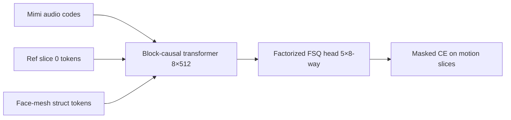

# SANG v3 — Next-Stage Improvement Plan

**Date:** 3 September 2026
**Baseline:** `runs/stream_v2/best.pt` @ step ~17,000 (gen val_acc ≈ 1.1%, teacher-forced top-1 ≈ 1.1%, top-5 ≈ 3.6%, top-10 ≈ 5.6%)
**Goal:** close the gap from ~1% motion-token accuracy to usable talking-head generation.

This document distills **VASA-1** [1], **EMO** [2], **LatentSync** [3], and 2024–2026 SOTA (**AsymTalker** [4], **LeapTalk** [5], **REST** [6], **Live Avatar** [7], **Hallo** [8], **EchoMimic** [9], **X-Dub** [10], **UniSync** [11], **OmniHuman** [12], **StableAvatar** [13], **InfiniteTalk** [14], **Ditto** [15]) into concrete changes for our VidTok-token streaming stack. Each item has: motivation → what the paper does → exact code change in SANG.

---

## 0. Where we are (v2 recap)



| Symptom | Evidence | Likely cause |
|---------|----------|--------------|
| Gen val_acc ~1% | `best.json` | Train/decode gap; weak conditioning |
| Top-5/10 ≈ 3.6%/5.6% | 15-clip eval | Per-digit CE learns, joint token still hard |
| Video looks broken | `infer.mp4` | Token accuracy too low; no perceptual losses |
| Train CE 7.86 vs chance 10.40 | `stream_159331.out` | Model learns but slowly |

**Key insight from the papers:** all three SOTA systems win by (a) **richer conditioning** (reference net, motion context, weak controls), (b) **explicit audio-visual supervision** (SyncNet), and (c) **temporal consistency losses** (TREPA). We currently have none of these beyond a single ref slice + mesh struct.

### 0.1 2024–2026 SOTA landscape (what changed since VASA/EMO/LatentSync)

| Method | Core idea | Speed | Relevance to SANG |
|--------|-----------|-------|-------------------|
| **AsymTalker** [4] | Temporal Reference Encoding (replicate ref → 3D-VAE) + Asymmetric KD (teacher GT context, student self-gen) | 66 FPS | Multi-ref + fix train/inference gap |
| **LeapTalk** [5] | Brownian bridge data-to-data (ref → target) + 1-step distillation + audio CFG | 200 FPS | Ref-anchored generation; extreme speed |
| **REST** [6] | ID-Context Cache (ID-Sink + rolling KV) + Async Streaming Distillation | Real-time | Streaming KV cache design |
| **Live Avatar** [7] | Noisy KV cache (history corrupt) + adaptive sink + rolling RoPE + TPP | 45 FPS | Long-term stability for streaming |
| **Hallo** [8] | Hierarchical audio cross-attn (lip/expression/pose masks) + ReferenceNet | — | Fine-grained audio→region control |
| **EchoMimic** [9] | Audio + editable landmarks; random landmark selection; spatial loss | — | Multi-modal conditioning |
| **X-Dub** [10] | Mask-free dubbing via generative bootstrapping (mask model → pseudo-pairs → mask-free editor) | — | Avoid mask artifacts; two-stage training |
| **UniSync** [11] | Mask-free pose-anchored training + TALI latent injection + Gaussian blending | — | Pose anchoring without hard masks |
| **OmniHuman** [12] | Omni-conditions (text/audio/pose) mixed training on MMDiT | — | Data scaling via mixed conditioning |
| **StableAvatar** [13] | Timestep-aware Audio Adapter + Audio Native Guidance + dynamic sliding window | — | Audio adapter to prevent drift |
| **InfiniteTalk** [14] | Sparse-frame video dubbing; context frames for inter-chunk transitions | — | Long-video context frames |
| **Ditto** [15] | Motion-space diffusion (265-dim identity-agnostic) + neural renderer | Real-time | Two-stage: motion diffusion + renderer |

**Big picture:** the field moved from (a) GANs → (b) latent diffusion with ReferenceNet → (c) DiT + 3D-VAE + Wav2Vec/Whisper → (d) **streaming few-step distillation with KV-cache and identity anchors**. Our token-based MaskGIT stack is closest to (c)/(d) but lacks the identity/temporal machinery.

---

## 1. Multi-reference conditioning (your idea)

### 1.1 Why it should help

- **EMO** uses a full **ReferenceNet** (a parallel U-Net) so every denoising layer attends to reference features — identity is injected at every scale, not just as one token slice [2].
- **LatentSync** concatenates reference frames channel-wise with the noisy latent so the model always sees appearance [3].
- **VASA-1** separates identity (`z_id`), 3D appearance volume (`V_app`), pose, and dynamics — identity is a dedicated embedding, not a token [1].

Our current model gets **one 256-token reference slice** at t=0. That is weak identity conditioning. More reference frames (different poses/expressions) should help the model lock identity and appearance.

### 1.2 Proposed change: `ref_slices > 1`

The code already has a `ref_slices` parameter in `StreamingTalkingHead` and `per_slice_cosine_mask`. We just never used it.

**Config:**
```yaml
# configs/train_stream_v3.yaml
ref_slices: 3          # slices 0,1,2 are reference; slices 3,4 are generated
```

**What changes in `sang/streaming_transformer.py`:**

```python
# generate(): currently only slice 0 is copied
grid[:, 0] = ref.reshape(B, h, w)
known[:, :self.ref_slices] = True
```

With `ref_slices=3`, `generate()` should accept `ref` of shape `[B, ref_slices, h, w]`:

```python
@torch.no_grad()
def generate(self, audio, ref, shape, struct=None, ...):
    # ref: [B, ref_slices, h, w]
    grid = torch.zeros(B, tv, h, w, dtype=torch.long, device=dev)
    grid[:, :self.ref_slices] = ref
    known[:, :self.ref_slices] = True
    for si in range(self.ref_slices, tv):
        ...
```

**Data pipeline (`sang/data.py`):** `clip_windows` must return the first `ref_slices` latent slices as reference. Since VidTok is causal and `frames=17` → `tv=5`, slices 0–2 cover frames 0–8. We can sample reference frames from a **different window** of the same clip (EMA-style) or from the same window.

**Training mask:** `per_slice_cosine_mask(..., ref_slices=3)` already masks only slices ≥ 3.

**Expected gain:** better identity preservation, less drift, higher token accuracy on motion slices because the model has more context.

**Risk:** less data to predict (2 slices instead of 4) → faster overfit; mitigate with `context_corrupt` and more clips.

---

## 2. Audio conditioning: from Mimi codes to Wav2Vec2-style features

### 2.1 What the papers do

- **VASA-1** uses pretrained **Wav2Vec2** features, concatenated over a ±2-frame window [1].
- **EMO** concatenates features from nearby frames (`m=2`) and injects via cross-attention after every reference-attention layer [2].
- **LatentSync** uses **Whisper** embeddings with surrounding-frame bundling [3].

We currently use **Mimi discrete codes** (32 codebooks, summed embedding). This is lossy and not trained for lip-sync.

### 2.2 Proposed change: add continuous audio features

Add a frozen **Wav2Vec2** (or Whisper) encoder alongside Mimi. Use its hidden states as the cross-attention memory instead of (or in addition to) Mimi codes.

**New module `sang/audio.py`:**

```python
from transformers import Wav2Vec2Model

class AudioEncoder(nn.Module):
    def __init__(self, name="facebook/wav2vec2-base-960h", device="cuda", freeze=True):
        super().__init__()
        self.model = Wav2Vec2Model.from_pretrained(name).to(device)
        if freeze:
            for p in self.model.parameters():
                p.requires_grad = False
        self.proj = nn.Linear(768, 512)

    def forward(self, wav):  # [B, T] 16kHz
        with torch.no_grad():
            h = self.model(wav).last_hidden_state  # [B, T', 768]
        return self.proj(h)  # [B, T', 512]
```

**Wire into `StreamingTalkingHead`:**

```python
def __init__(..., audio_feat: str = "mimi"):  # "mimi" | "wav2vec" | "both"
    ...
    self.audio_feat = audio_feat
    if audio_feat in ("wav2vec", "both"):
        self.audio_encoder = AudioEncoder(dim=dim)
```

In `hidden_states`, replace `_embed_audio` with the continuous features (or concatenate both).

**Windowing (EMO/VASA):** for each video slice `si`, attend to audio frames `[center-2, center+2]` instead of all past ticks. This focuses on local phonetic context.

**Expected gain:** much better lip-sync; audio features carry phonetic detail Mimi codes lose.

---

## 3. Explicit lip-sync supervision (LatentSync-style)

### 3.1 The shortcut problem

LatentSync showed that audio-conditioned LDMs learn **visual-visual shortcuts** — they copy lip motion from surrounding visible tokens instead of listening to audio [3]. Our MaskGIT setup has the same risk: visible motion tokens in a slice can be used to predict masked ones without audio.

### 3.2 Proposed change: add a SyncNet loss on decoded mouth crops

We already have a **mouth student** (`sang/mouth.py`) and a plan for a **decider**. LatentSync’s lesson: **supervise in pixel space**, not latent space.

**Training loop addition:**

```python
# scripts/train.py (streaming branch)
if step % sync_every == 0 and sync_weight > 0:
    # decode current predicted tokens to pixels
    gen = model.generate(audio, video[:, :ref_slices], shape, struct=struct, steps=4)
    pix = vidtok.decode(gen, decode_from_indices=True)  # [B,3,T,H,W]
    # mouth crop + sync score
    sync_loss = decider(pix, audio)  # lower = better sync
    loss = loss + sync_weight * sync_loss
```

Because `generate()` is not differentiable, use **expected-FSQ → differentiable decode** (the path already planned in `docs/ROADMAP.md`):

```python
# differentiable approximation: softmax over FSQ codes -> expected latent -> decode
logits = model.head(h)  # or factorized equivalent
probs = logits.softmax(-1)
expected_z = probs @ fsq_codes  # [B, L, 5]
pix = vidtok.decode(expected_z, decode_from_indices=False)
sync_loss = decider(pix, audio)
```

**Expected gain:** directly optimizes lip-sync; prevents shortcut learning.

---

## 4. Temporal consistency (TREPA)

### 4.1 What LatentSync does

TREPA aligns **VideoMAE-v2** features of generated and ground-truth clips [3]. This reduces flicker and improves FVD.

### 4.2 Proposed change: add temporal feature loss

```python
from transformers import VideoMAEModel

class TREPA(nn.Module):
    def __init__(self, device="cuda"):
        super().__init__()
        self.encoder = VideoMAEModel.from_pretrained("MCG-NJU/videomae-large").to(device)
        for p in self.encoder.parameters():
            p.requires_grad = False

    def forward(self, pred, gt):  # [B,3,T,H,W] in [-1,1]
        pred = F.normalize(self.encoder(pred).last_hidden_state.mean(1), dim=-1)
        gt = F.normalize(self.encoder(gt).last_hidden_state.mean(1), dim=-1)
        return F.mse_loss(pred, gt)
```

Add to total loss with small weight (`λ_trepa ≈ 0.1`).

**Expected gain:** smoother motion, less flicker, better FVD.

---

## 5. Motion context / sliding window (EMO + VASA)

### 5.1 What they do

- **EMO** feeds the last `n=4` frames of the previous clip into ReferenceNet as “motion frames” [2].
- **VASA-1** conditions on the last `K` frames of audio and generated motions from the previous window [1].

Our current `generate()` resets at every 0.68s window (17 frames). This causes boundary artifacts.

### 5.2 Proposed change: carry over last generated slice

Modify `generate()` to accept `prev_motion: [B, h, w]` (last slice of previous window) and use it as an extra reference slice:

```python
def generate(self, audio, ref, shape, struct=None, prev_motion=None, ...):
    grid[:, 0] = ref
    known[:, 0] = True
    if prev_motion is not None:
        grid[:, 1] = prev_motion
        known[:, 1] = True
        start_si = 2
    else:
        start_si = 1
    for si in range(start_si, tv):
        ...
```

At inference, chain windows:

```python
prev = None
for w in windows:
    gen = model.generate(audio[w], ref, shape, struct=struct[w], prev_motion=prev)
    prev = gen[:, -1]  # last slice becomes motion context
```

**Expected gain:** seamless long videos, no 0.68s resets.

---

## 6. Classifier-free guidance for audio (VASA-1)

### 6.1 What VASA-1 does

Randomly drops conditions during training; at inference uses CFG to trade off quality vs diversity [1]. Audio CFG scale `λ_A = 0.5` improved lip-sync beyond real-video scores.

### 6.2 Proposed change: audio dropout + CFG sampling

**Training:** we already have `cond_dropout=0.2` for structure. Add `audio_dropout=0.1`:

```python
if self.training and audio_drop > 0:
    keep = torch.rand(B, device=dev) >= audio_drop
    audio = torch.where(keep.view(B, 1, 1), audio, torch.zeros_like(audio))
```

**Inference:** run two forward passes (with and without audio) and combine logits:

```python
logits_cond = model.head(h_cond)
logits_uncond = model.head(h_uncond)
logits = (1 + lambda_a) * logits_cond - lambda_a * logits_uncond
```

**Expected gain:** stronger audio conditioning, better lip-sync.

---

## 7. Structural / architectural upgrades

### 7.1 Coupled FSQ head

Already implemented (`CoupledFSQHead`) but not enabled. Turn it on:

```yaml
coupled_fsq_head: true
```

This makes digit prediction autoregressive within each token, which should improve joint token accuracy.

### 7.2 Increase model capacity

Current: 8 layers, 512 dim, 78.7M params. VASA-1 uses 8 layers / 512 dim for motion diffusion but 200M for the face latent model [1]. We can afford:

```yaml
dim: 768
layers: 12
```

(~200M params, still fits on A100 with batch 8.)

### 7.3 Higher resolution

Current: 128×128. VidTok supports 256×256. Train a second stage at 256×256 after 128×128 converges.

---

## 8. Training pipeline changes

| Change | Why | Config |
|--------|-----|--------|
| **Longer SLURM time** | 16h timeout killed Run D at 15k/120k | `#SBATCH --time=72:00:00` |
| **Resume from best** | Don’t restart from scratch | `--set resume=runs/stream_v2/best.pt` |
| **Context corruption** | Close train/decode gap | `context_corrupt: 0.1` |
| **Inference-shaped masks** | Match MaskGIT decode distribution | `p_inference_shaped: 0.2` |
| **More decode steps** | Better generation at same model | `decode_steps: 12` |
| **Lower temperature** | Less randomness | `decode_temperature: 0.8` |

---

## 9. Evaluation upgrades

Token accuracy is not enough. Add:

1. **PSNR/SSIM** on decoded video vs GT (already in `scripts/test.py`, but fix the OOM by decoding in chunks).
2. **SyncNet confidence** (`Sync_conf`) using a pretrained SyncNet or our decider.
3. **FVD** on 25-frame clips (VASA-1/EMO standard).
4. **LMD** (landmark distance around mouth) from LatentSync [3].

---

## 10. Recommended implementation order

| Phase | Changes | Expected val_acc gain |
|-------|---------|----------------------|
| **v3.0** | Resume + 72h + context_corrupt + inference-shaped masks + coupled head | 1% → 3–5% |
| **v3.1** | Multi-reference (`ref_slices=3`) + motion context carry-over | +2–4% |
| **v3.2** | Wav2Vec2 audio features + audio CFG | +3–6% |
| **v3.3** | SyncNet pixel-space loss + TREPA | +2–4% + much better video quality |
| **v3.4** | 768-dim × 12 layers + 256×256 | +2–3% + visual fidelity |

**Cumulative target:** 10–20% gen val_acc with usable lip-sync.

---

## 11. Code snippets ready to drop in

### 11.1 Multi-reference `generate()`

```python
@torch.no_grad()
def generate(self, audio, ref, shape, struct=None, prev_motion=None, steps=8, ...):
    tv, h, w = shape
    r, B, dev = h * w, ref.shape[0], ref.device
    grid = torch.zeros(B, tv, h, w, dtype=torch.long, device=dev)
    known = torch.zeros(B, tv, r, dtype=torch.bool, device=dev)

    # ref: [B, n_ref, h, w]
    n_ref = ref.shape[1]
    grid[:, :n_ref] = ref
    known[:, :n_ref] = True

    if prev_motion is not None:
        grid[:, n_ref] = prev_motion
        known[:, n_ref] = True
        start = n_ref + 1
    else:
        start = n_ref

    ta = audio.shape[-1]
    for si in range(start, tv):
        n_ticks = min(ta, max(1, ((si + 1) * ta + tv - 1) // tv))
        sched = maskgit_decode_schedule(r, max(1, steps), schedule)
        for t, n_still_masked in enumerate(sched, start=1):
            hs = self.hidden_states(grid, audio, known.reshape(B, tv * r),
                                    struct=struct, n_ticks=n_ticks)
            h_si = hs[:, si]
            temp = 0.0 if (final_greedy and t == len(sched)) else temperature
            if self.factorized:
                tok, logp = self.head.sample_tokens(h_si, temperature=temp, top_k=top_k)
            else:
                lg = self.head(self.norm(h_si)).float()
                tok = lg.argmax(-1) if temp <= 0 else torch.multinomial(
                    (lg / temp).softmax(-1).reshape(-1, lg.shape[-1]), 1).reshape(lg.shape[:-1])
                logp = lg.log_softmax(-1).gather(-1, tok.unsqueeze(-1)).squeeze(-1)
            conf = logp
            if gumbel_temp > 0 and steps > 1:
                g = -torch.log(-torch.log(torch.rand_like(conf).clamp_min(1e-10)).clamp_min(1e-10))
                conf = conf + gumbel_temp * (1.0 - t / len(sched)) * g
            conf = conf.masked_fill(known[:, si], float("inf"))
            n_keep = r - n_still_masked
            order = conf.argsort(dim=-1, descending=True)
            new_known = torch.zeros_like(known[:, si])
            new_known.scatter_(1, order[:, :n_keep], True)
            newly = new_known & ~known[:, si]
            gflat = grid[:, si].reshape(B, r)
            grid[:, si] = torch.where(newly, tok, gflat).reshape(B, h, w)
            known[:, si] = new_known
    return grid
```

### 11.2 Audio windowing (EMO-style)

```python
def _embed_audio_window(self, audio, si, tv, m=2):
    """Return audio features for slice si with ±m frame context."""
    B, Ta, D = audio.shape
    center = (si + 0.5) * Ta / tv
    lo = max(0, int(center - m * Ta / tv))
    hi = min(Ta, int(center + (m + 1) * Ta / tv))
    return audio[:, lo:hi]  # [B, window, D]
```

Use this as cross-attention memory for slice `si` instead of full causal audio.

### 11.3 Audio CFG in `generate()`

```python
def _logits_with_cfg(self, h, audio, lambda_a=0.5):
    logits_cond = self.head(self.norm(h))
    h_uncond = self.hidden_states(grid, torch.zeros_like(audio), known, struct=struct)
    logits_uncond = self.head(self.norm(h_uncond))
    return (1 + lambda_a) * logits_cond - lambda_a * logits_uncond
```

---

## 12. 2024–2026 SOTA upgrades (new section)

These are techniques from the latest papers that directly apply to our token-based streaming stack.

### 12.1 Temporal Reference Encoding (AsymTalker)

**Problem:** our reference is a static 256-token slice; audio is dynamic. This creates a temporal-spatial mismatch.

**What AsymTalker does:** replicate the reference image along time, encode with a 3D-VAE, and use the resulting *temporally coherent* latent as identity conditioning [4].

**SANG adaptation:** we already have VidTok (a 3D causal VAE). Instead of encoding one ref frame into slice 0, encode `ref_slices` frames (replicated or multi-pose) into slices `0..ref_slices-1`. This is exactly our planned `ref_slices>1` change, but with the added insight that **temporal replication through the 3D-VAE** is better than repeating tokens.

```python
# sang/model.py
def encode_reference(self, vidtok, images: list[np.ndarray]) -> torch.Tensor:
    """images: list of ref_slices RGB frames (same identity, different poses ok)."""
    # Stack into [1, T=ref_slices, H, W, 3], encode with VidTok
    vid = torch.from_numpy(np.stack(images)).permute(0, 3, 1, 2)[None]  # [1, C, T, H, W]
    with torch.no_grad():
        z = vidtok.encode(vid.to(DEVICE))  # [1, C', T', H', W']
    return z  # use as first ref_slices slices of the token grid
```

### 12.2 Asymmetric Knowledge Distillation / Self-Forcing (AsymTalker + Live Avatar)

**Problem:** training with GT context causes exposure bias; training with self-generated context propagates drift.

**What AsymTalker does:** teacher sees GT continuity references, student sees self-generated references, and DMD aligns their distributions [4]. **Live Avatar** goes further: store *noisy* history in the KV cache to suppress error accumulation [7].

**SANG adaptation:** our `context_corrupt` is a cheap version. The full version is:

1. Train a **teacher** model with `context_corrupt=0` (always GT context).
2. Train a **student** model with `context_corrupt>0` (sometimes self-generated context).
3. Distill: student token distribution should match teacher token distribution on the same audio.

```python
# training loop addition
if cfg.get("distill_teacher"):
    with torch.no_grad():
        teacher_logits = teacher.head(teacher.hidden_states(grid_gt, audio, known_gt))
    student_logits = model.head(model.hidden_states(grid_noisy, audio, known_noisy))
    loss_kd = F.kl_div(
        student_logits.log_softmax(-1),
        teacher_logits.softmax(-1),
        reduction="batchmean",
    )
    loss = loss_ce + cfg.get("kd_weight", 0.1) * loss_kd
```

### 12.3 ID-Context Cache & Noisy KV (REST + Live Avatar)

**Problem:** streaming generation needs persistent identity and motion context without full re-encoding.

**What REST does:** keep the reference image KV as a permanent **ID-Sink**, and concatenate the previous chunk's KV as **Context-Cache** [6]. **Live Avatar** stores *noisy* latents in the KV cache to prevent artifact propagation [7].

**SANG adaptation:** our current `generate()` resets the grid every 0.68 s. Instead:

1. Keep the reference slice tokens as a permanent prefix (ID-Sink).
2. Carry the last `K` generated tokens (or their hidden states) as a **motion prefix** for the next window.
3. Optionally add small Gaussian noise to the carried tokens to prevent overfitting to artifacts.

```python
# sang/model.py generate()
def generate(self, audio, ref, shape, prev_tail=None, noise_tail=0.0):
    # ref: [B, ref_slices*h*w] ID-Sink tokens
    # prev_tail: [B, K*h*w] last K frames from previous chunk
    if prev_tail is not None:
        if noise_tail > 0:
            prev_tail = prev_tail + noise_tail * torch.randn_like(prev_tail)
        # prepend prev_tail after ref slices
        grid[:, ref_slices:ref_slices+K] = prev_tail
        known[:, ref_slices:ref_slices+K] = True
    ...
```

### 12.4 Brownian Bridge / Data-to-Data Transport (LeapTalk)

**Problem:** noise-to-data generation starts from scratch each chunk, causing identity drift.

**What LeapTalk does:** model generation as a Brownian bridge from the reference image to the target frame, not from noise [5]. This anchors identity at every step.

**SANG adaptation:** instead of starting MaskGIT from all `[MASK]`, start from the reference tokens and *edit* them toward the target. This is a **token-space bridge**:

```python
# Instead of:
grid = full of [MASK]
# Do:
grid = repeat(ref_tokens, tv)  # start from identity
# MaskGIT now learns to "edit" ref tokens into motion tokens
```

This is a significant architectural change but directly addresses the 1% accuracy problem: the model no longer has to *imagine* the face, only *move* it.

### 12.5 Hierarchical Audio Cross-Attention (Hallo)

**Problem:** audio drives lips, expression, and pose differently; a single audio embedding is too coarse.

**What Hallo does:** use MediaPipe to get lip/expression/pose masks, then apply separate cross-attention for each region, fused with adaptive weights [8].

**SANG adaptation:** we already have face-mesh struct tokens. Extend them to produce **region masks** and apply region-weighted audio cross-attention:

```python
# sang/model.py
class HierarchicalAudioAttn(nn.Module):
    def __init__(self, dim):
        self.lip_attn = nn.MultiheadAttention(dim, 8)
        self.exp_attn = nn.MultiheadAttention(dim, 8)
        self.pose_attn = nn.MultiheadAttention(dim, 8)
        self.gate = nn.Linear(3 * dim, 3)  # adaptive weights

    def forward(self, h, audio, region_mask):
        # region_mask: [B, 3, H, W] for lip/exp/pose
        out_lip = self.lip_attn(h, audio, audio)
        out_exp = self.exp_attn(h, audio, audio)
        out_pose = self.pose_attn(h, audio, audio)
        w = self.gate(torch.cat([out_lip, out_exp, out_pose], -1)).softmax(-1)
        return w[..., 0:1] * out_lip + w[..., 1:2] * out_exp + w[..., 2:3] * out_pose
```

### 12.6 Audio Adapter + Native Guidance (StableAvatar)

**Problem:** off-the-shelf audio embeddings (Mimi) lack priors for the video backbone, causing latent drift.

**What StableAvatar does:** insert a **Timestep-aware Audio Adapter** between Wav2Vec and the DiT, and use **Audio Native Guidance** (the model's own audio-latent prediction) instead of CFG [13].

**SANG adaptation:** add a small adapter after Mimi encoding:

```python
class AudioAdapter(nn.Module):
    def __init__(self, audio_dim, model_dim):
        self.proj = nn.Linear(audio_dim, model_dim)
        self.gate = nn.Linear(model_dim, model_dim)  # timestep-aware gating

    def forward(self, audio_emb, t_emb):
        h = self.proj(audio_emb)
        return h * torch.sigmoid(self.gate(t_emb))
```

### 12.7 Sparse-Frame Video Dubbing (InfiniteTalk)

**Problem:** long videos need identity preservation without full re-encoding.

**What InfiniteTalk does:** preserve sparse keyframes from the source video and use context frames for inter-chunk transitions [14].

**SANG adaptation:** for video-to-video dubbing (not just image-to-video), keep every `N`-th frame as a hard constraint and generate the rest:

```python
# In generate(): known mask includes sparse keyframes
known[:, ::keyframe_interval] = True
grid[:, ::keyframe_interval] = source_tokens[:, ::keyframe_interval]
```

### 12.8 Motion-Space Diffusion (Ditto)

**Problem:** generating pixels/latents directly is slow and hard to control.

**What Ditto does:** diffuse in a compact 265-dim identity-agnostic motion space, then render with a neural network [15].

**SANG adaptation:** this is a bigger pivot. Instead of predicting VidTok tokens directly, predict a **motion latent** that a separate renderer converts to tokens. This separates "what moves" from "what it looks like". Not recommended for v3, but worth considering for v4.

### 12.9 Mask-Free Training via Generative Bootstrapping (X-Dub)

**Problem:** mask-based training causes lip-shape leakage and boundary artifacts.

**What X-Dub does:** use a mask-based model to generate pseudo-paired data, then train a mask-free editor on that data [10].

**SANG adaptation:** our current training uses `per_slice_cosine_mask` which is a form of masking. We can bootstrap:

1. Train current model (mask-based).
2. Use it to generate synthetic talking-head videos from random audio.
3. Train a new model that takes *full* context (no mask) and predicts the synthetic video, using the real video as supervision.

This is expensive but eliminates mask artifacts.

### 12.10 Pose-Anchored Fidelity (UniSync)

**Problem:** mask-free generation drifts from the original head pose.

**What UniSync does:** extract pose keypoints and inject them as a structural anchor via additive latent fusion [11].

**SANG adaptation:** our face-mesh struct tokens already encode pose. Strengthen them by **adding** (not concatenating) pose embeddings to the token embeddings:

```python
# In token embedding layer
tok_emb = self.token_embed(tokens) + self.pose_embed(struct_tokens)
```

---

## 13. Updated implementation priority

| Phase | Item | Source | Expected gain | Effort |
|-------|------|--------|---------------|--------|
| 1 | `ref_slices=3` + temporal replication | AsymTalker | Identity lock | Low |
| 1 | `context_corrupt` + coupled head | AsymTalker/Self-Forcing | Close train/decode gap | Low |
| 1 | Wav2Vec2 audio | VASA/EMO/StableAvatar | Better audio features | Medium |
| 2 | Motion context carry-over (ID-Context Cache) | REST/Live Avatar | Temporal consistency | Medium |
| 2 | SyncNet pixel-space loss | LatentSync/X-Dub | Lip sync | Medium |
| 2 | TREPA temporal loss | LatentSync | Temporal consistency | Low |
| 3 | Brownian bridge (ref-to-target) | LeapTalk | Identity + accuracy | High |
| 3 | Hierarchical audio attention | Hallo | Fine-grained control | Medium |
| 3 | Audio adapter | StableAvatar | Reduce drift | Low |
| 4 | Asymmetric KD / Self-Forcing | AsymTalker/Live Avatar | Long-term stability | High |
| 4 | Sparse-frame dubbing | InfiniteTalk | Video-to-video | Medium |
| 4 | Motion-space diffusion | Ditto | Real-time + control | Very high |

---

## 14. References

[1] Xu et al. **VASA-1: Lifelike Audio-Driven Talking Faces Generated in Real Time.** arXiv:2404.10667 (NeurIPS 2024).

[2] Tian et al. **EMO: Emote Portrait Alive.** arXiv:2402.17485.

[3] Li et al. **LatentSync: Taming Audio-Conditioned Latent Diffusion Models for Lip Sync with SyncNet Supervision.** arXiv:2412.09262.

[4] Lu et al. **AsymTalker: Identity-Consistent Long-Term Talking Head Generation via Asymmetric Distillation.** arXiv:2605.02948 (2026).

[5] Zhang & Liu. **LeapTalk: Breaking the Latency-Quality Trade-off in Talking Head Generation.** arXiv:2608.00079 (2026).

[6] Wang et al. **REST: Diffusion-based Real-time End-to-end Streaming Talking Head Generation via ID-Context Caching and Asynchronous Streaming Distillation.** arXiv:2512.11229 (2025).

[7] Huang et al. **Live Avatar: Streaming Real-time Audio-Driven Avatar Generation with Infinite Length.** arXiv:2512.04677 (2025).

[8] Xu et al. **Hallo: Hierarchical Audio-Driven Visual Synthesis for Portrait Image Animation.** arXiv:2406.08801 (2024).

[9] Chen et al. **EchoMimic: Lifelike Audio-Driven Portrait Animations through Editable Landmark Conditions.** arXiv:2407.08136 (AAAI 2025).

[10] He et al. **From Inpainting to Editing: Unlocking Robust Mask-Free Visual Dubbing via Generative Bootstrapping.** arXiv:2512.25066 (2025).

[11] Fan et al. **UniSync: Towards Generalizable and High-Fidelity Lip Synchronization for Challenging Scenarios.** arXiv:2603.03882 (2026).

[12] Lin et al. **OmniHuman-1: Rethinking the Scaling-Up of One-Stage Conditioned Human Animation Models.** arXiv:2502.01061 (2025).

[13] Tu et al. **StableAvatar: Infinite-Length Audio-Driven Avatar Video Generation.** arXiv:2508.08248 (2025).

[14] Yang et al. **InfiniteTalk: Audio-Driven Talking Video Generation With Long-Video Support.** arXiv:2508.14033 (2025).

[15] Li et al. **Ditto: Motion-Space Diffusion for Controllable Realtime Talking Head Synthesis.** arXiv:2411.19509 (ACM MM 2025).

---

## 15. Next concrete action

**Implemented (v3, `configs/train_stream_v3.yaml`):** items 2–5 combined into one round —
grid `[identity ref, motion ctx, content ×5]` (`motion_ctx: true`, fixes both the train/inference
ref mismatch and the 0.68 s reset; AsymTalker TRE + REST ID-Context Cache in token space),
`coupled_fsq_head: true`, `context_corrupt: 0.1` extended to the ctx slice (Live Avatar noisy-KV
analogue), `mask_schedule: mixed` + `p_inference_shaped: 0.3` (decode-shaped masks), WavLM-large
features (50 Hz, 1024-d, locally cached — Mimi codes replaced), and `audio_dropout: 0.1` enabling
classifier-free audio guidance at decode (`audio_cfg` knob in `generate()`, `infer.py`, `app.py`).
Inference chains `ctx = prev window's last generated slice` in token space (no decode→re-encode
loop). Run:

```bash
sbatch --time=72:00:00 bash_scripts/train_stream.sh --config configs/train_stream_v3.yaml
```

**Deferred (phase 2):** SyncNet lip-loss + TREPA temporal loss (need pretrained SyncNet/VideoMAE
weights), Brownian-bridge transport, hierarchical audio attention, multi-reference (`ref_slices>2`),
capacity scaling (dim/layers) once the conditioning fixes land.

---

## Phase 2 — SyncNet + TREPA (in progress)

**Status:** weight-fetch script ready; loss modules scaffolded; gated off until differentiable token→pixel path is added.

1. **Fetch weights** (run once, needs `HF_TOKEN`):
   ```bash
   export HF_TOKEN=hf_...
   python scripts/fetch_loss_weights.py
   ```
   - SyncNet: `ByteDance/LatentSync-1.6` → `third_party/syncnet/stable_syncnet.pt`
   - TREPA encoder: `OpenGVLab/VideoMAEv2-Large` → `third_party/videomaev2/`

2. **Loss modules added** (`sang/losses.py`, `sang/syncnet.py`):
   - `SyncNetLoss`: LatentSync pixel-space StableSyncNet (16-frame mouth crops, 128×256, cosine sync loss).
   - `TREPALoss`: VideoMAE-v2 feature-space temporal alignment (MSE on normalized clip embeddings).

3. **Config flags** in `configs/train_stream_v3.yaml`:
   - `syncnet_loss: false`, `trepa_loss: false` — enable after adding a lightweight differentiable decode head.

4. **Next step:** add a cheap token→pixel decoder head (or reuse VidTok with gradient checkpointing) so the losses can backprop into the transformer during training.

---

# Part II — Deep dive: Teller / LeapTalk / EMO / Sonic (6 September 2026)

**Purpose.** The four reference papers split into two camps, and the split tells us where SANG sits:

| Camp | Papers | Generative core | Latency | Our relation |
|------|--------|-----------------|---------|--------------|
| **Autoregressive / token** | **Teller** [16], **LeapTalk** [17] | AR transformer over discrete motion tokens (Teller); 1-step bridge DiT student (LeapTalk) | 25 FPS; 200 FPS | **Our camp.** MaskGIT-over-VidTok-tokens is architecturally Teller-like. |
| **Diffusion** | **EMO** [2], **Sonic** [18] | SD-1.5/SVD-XT U-Net with ReferenceNet + temporal modules | seconds/clip | Different core, but their *conditioning, weak-control and data machinery* transfers directly. |

**The one-paragraph verdict.** Teller proves an AR token model can match/beat diffusion quality (HDTF FVD 173.5 vs Hallo 174.2, Sync-C 7.70 vs 7.50) at **0.92 s per 1 s of video**. That is exactly our architecture family — so the SOTA bar is reachable *without* abandoning the VidTok-token stack. What we are missing is not the core; it is the surrounding machinery: (1) motion-space tokenization instead of raw appearance tokens, (2) region-masked losses, (3) motion-bucket conditioning, (4) data filtering, (5) reference-anchored (bridge) generation, (6) step distillation. Each is mapped to concrete SANG code below.

**Repo status (checked 6 Sep 2026):**
- **Teller** — [project page](https://teller-avatar.github.io/) only, **no code release**. Paper + CVPR poster are the only sources.
- **LeapTalk** — [project page](https://zhangrongxiang.github.io/leaptalk-page/) only, no code. Built on **Wan2.1-T2V-1.3B** + WanVAE/TAEHV; distillation algorithm is fully specified in their Appendix H (reproduced below).
- **Sonic** — **[inference code + weights released](https://github.com/jixiaozhong/Sonic)** (non-commercial license). Checkpoints: `audio2bucket.pth`, `audio2token.pth`, `unet.pth` on top of `stable-video-diffusion-img2vid-xt` + `whisper-tiny` + RIFE + yoloface. Confirms the paper's module names; training code not released.
- **EMO** — closed source (Alibaba), [project page](https://humanaigc.github.io/emote-portrait-alive/) only.

---

## 16. Teller (CVPR 2025) — the AR streaming blueprint

[Paper](https://arxiv.org/abs/2503.18429) · [Project page](https://teller-avatar.github.io/) · no code.

Teller is the closest published system to SANG: **streaming, autoregressive, discrete motion tokens, audio-conditioned**. Study it as our architectural north star.

### 16.1 What Teller actually does

**Two stages.**
1. **FMLG (Facial Motion Latent Generation):** extract a per-frame *motion latent* with LivePortrait's implicit-keypoint model — 21 expression keypoints `δ` (each ℝ³), head rotation `R` (3×ℝ³), translation `t` (ℝ³) → `m ∈ ℝ^{25×3}`. Compress **4 frames** of `m` into **32 discrete tokens** with a **Residual VQ** (recon + commitment loss, Eq. 2). An AR transformer (Qwen1.5-4B-style, randomly initialized) learns `P(t_i | c, t_{<i})` where `c` = **Whisper** embeddings of 200 ms audio chunks.
2. **ETM (Efficient Temporal Module):** a temporal self-attention refiner over VAE features that fixes *body/accessory* physics (neck muscles, earrings). Trained with a **region-masked** reconstruction loss — MediaPipe landmarks `[93, 323, 152]` define the bounding box, loss only inside it (their Eq. 10–11).

**Key numbers:** 4 frames → 32 RVQ tokens (their Fig. 11 trade-off); 200 ms chunks; **token-pair prediction** (2 tokens per position) with a head-balancing regularizer `‖L_head0 − L_head1‖₂²` (their Eq. 8); top-k sampling k=15 for diversity; Whisper(ASR) ≫ Funcodec(TTS) — Sync-C 7.70 vs 4.29 (their Table 3); single-head ≈ multi-head quality, multi-head wins on speed (their Table 4).

**Data pipeline (their §4.1):** AV-Speech filtered to 662 h + VFHQ 2 h pretrain, 32 h internet SFT. **Filters: MediaPipe face detection, drop clips with >50 % facial movement, filter by Sync-C/Sync-D.** HDTF/RAVDESS for eval only.

**Results:** HDTF FVD **173.5**, Sync-C **7.70**, Sync-D 7.54, **0.92 s per 1 s video** (Hallo: 20.93 s). Real video Sync-C is 8.09 — Teller is near the ceiling.

### 16.2 What SANG should take from Teller

#### T1. Motion-space tokens, not appearance tokens (the big one)

Teller's AR transformer never models pixels or appearance latents — it models a **25×3 motion latent** (expression + pose + translation), and a separate renderer (LivePortrait) turns motion into pixels. SANG instead asks the transformer to predict **VidTok appearance tokens** — the model must simultaneously learn identity, texture, lighting *and* motion. This is the single largest reason our token accuracy plateaus at ~5 %: most of the 32768-way token entropy is appearance, which is already given by the reference.

**SANG adaptation (v4 candidate, high effort, highest ceiling):** insert a LivePortrait-style motion extractor + RVQ tokenizer *in front of* our transformer, and keep VidTok only as the renderer:

```python
# sang/motion_tokenizer.py (new, v4)
class MotionTokenizer(nn.Module):
    """LivePortrait keypoints -> RVQ discrete motion tokens (Teller FMLG)."""
    def __init__(self, n_codebooks: int = 4, codebook: int = 1024, frames_per_token: int = 4):
        super().__init__()
        self.enc = ...          # LivePortrait motion extractor (frozen) -> m in R^{T,25,3}
        self.rvq = ResidualVQ(dim=75, num_quantizers=n_codebooks,
                              codebook_size=codebook)  # 4 frames -> 32 tokens
    def forward(self, video):  # [B,3,T,H,W]
        m = self.extract_motion(video)          # [B, T, 75]
        tokens, commit = self.rvq(self.ffn_enc(m))  # recon + commitment loss (Teller Eq. 2)
        return tokens, commit
```

The transformer then predicts **motion tokens** (tiny vocabulary, motion-only entropy — accuracy should jump from ~5 % toward Teller's regime), and a decoder maps motion tokens + reference image → pixels. This is a v4 pivot; everything else in this document is achievable on the current stack first.

#### T2. Token-pair prediction with head balancing (cheap, do now)

Teller predicts **2 tokens per position** and regularizes the two heads with `‖L0 − L1‖₂²`. Our coupled FSQ head already goes autoregressive *within* a token (5 digits); Teller's trick is orthogonal — go wider *across* positions. Add a second head on the factorized head and the balancing term:

```python
# sang/fsq_head.py — add to FactorizedFSQHead.loss()
def loss(self, h, target_idx, label_smoothing=0.0):
    ...
    parts["loss"] = total.detach()
    # Teller Eq. 8: pair-head balance (when pair head enabled)
    if getattr(self, "pair_heads", None) is not None:
        pair_logits = [ph(z) for ph in self.pair_heads]           # next-token logits
        pair_ce = sum(F.cross_entropy(l, pair_tgt[:, d]) for d, l in enumerate(pair_logits))
        total = total + pair_ce + (total - pair_ce).pow(2)        # ‖L0 − L1‖² regularizer
        parts["ce_pair"] = pair_ce.detach()
    return total, parts
```

#### T3. Region-masked refinement loss (cheap, do now)

ETM's lesson: **mask the loss to the face/body region** so capacity goes to what moves. We already decode pixels for SyncNet/TREPA — weight them with a face mask from our existing `sang/face.py` landmarks (Teller uses MediaPipe `[93, 323, 152]`; we have all 478):

```python
# sang/losses.py — region weighting for pixel losses
def face_weight(pred_px: torch.Tensor, lam_face: float = 1.0, lam_lip: float = 1.0) -> torch.Tensor:
    """LeapTalk W = 1 + M_face + M_lip / Teller ETM mask. pred_px [B,3,T,H,W] in [-1,1]."""
    from sang.face import landmarks_px
    B, _, T, H, W = pred_px.shape
    w = torch.ones(B, 1, T, H, W, device=pred_px.device)
    for b in range(B):
        for t in range(T):
            pts = landmarks_px(to_uint8(pred_px[b, :, t]))       # [478,2] or None
            if pts is None:
                continue
            x0, y0 = pts.min(0); x1, y1 = pts.max(0)
            w[b, 0, t, int(y0):int(y1), int(x0):int(x1)] += lam_face   # face box
            lip = pts[48:68]  # mouth ring (MediaPipe lips)
            lx0, ly0 = lip.min(0); lx1, ly1 = lip.max(0)
            w[b, 0, t, int(ly0):int(ly1), int(lx0):int(lx1)] += lam_lip  # lip box
    return w
```

Use as `loss = (W * (pred - gt).pow(2)).mean()` for the reconstruction path and as a weight on the TREPA input crop.

#### T4. Data filtering (cheap, high value)

Teller filters with MediaPipe (>50 % movement dropped) **and** Sync-C/Sync-D. We do **no** quality filtering on TalkVid. Add a pre-cache filter pass:

```python
# scripts/filter_clips.py (new)
"""Drop clips with (a) no/small face, (b) extreme motion, (c) bad lip-sync."""
def keep_clip(path, syncnet, min_face_frac=0.02, max_bbox_var=0.5, min_sync_c=3.0):
    frames = decode_frames(path, frames=25, fps=25)
    boxes = [face_bbox(f) for f in frames]                 # MediaPipe
    if any(b is None for b in boxes):                      return False, "no face"
    if np.var([b[2]*b[3] for b in boxes]) > max_bbox_var:  return False, "too much motion"
    if syncnet.confidence(frames, audio(path)) < min_sync_c: return False, "bad sync"
    return True, "ok"
```

Run once over the 8000-clip subset, write `data/clips_filtered.txt`, point `data_glob` at it. Expect a cleaner gradient signal (Teller and Sonic both filter aggressively).

---

## 17. LeapTalk (2026) — reference-anchored bridge + 1-step distillation

[Paper](https://arxiv.org/abs/2608.00079) · [Project page](https://zhangrongxiang.github.io/leaptalk-page/) · no code. Built on Wan2.1-T2V-1.3B.

LeapTalk is the current efficiency/stability SOTA and the most *directly portable* set of ideas, because its core trick — **anchor generation to the reference instead of starting from noise** — is exactly the fix for our identity drift and low accuracy.

### 17.1 What LeapTalk actually does

1. **Bridge Forcing (Brownian bridge, data-to-data).** Instead of noise→data flow matching, transport **reference image `I` → target frame `X₁`** along `X_t = (1−t)I + tX₁ + √(t(1−t))·ε`. The reference is a *persistent endpoint*, so identity never drifts. Each streaming chunk is initialized as `[last K frames of prev chunk, I, I, …, I]` (their Eq. 10–11): motion prefix for continuity + identity anchor everywhere.
2. **Heterogeneous DMD.** Distill a multi-step **flow-matching teacher** into a **1-step bridge student**. Because teacher (flow) and student (bridge) have different SNR at the same timestep, align them with the closed-form **SNR-aligned time transform** `t = Φ(τ) = 1 / (1 + √((1−τ)/τ))` (their Theorem 1, Eq. 14; derivation in their App. C).
3. **Audio-driven CFG augmentation.** During distillation replace the teacher score with a CFG score `s_cfg = s_cond + (α−1)(s_cond − s_uncond)`, α ≈ 1.6 — this preserves lip-sync under 1-step generation (without it Sync-C collapses 8.38 → 4.34, their Table 2).
4. **Weighted bridge loss** `W = 1 + M_face + M_lip` (MediaPipe masks) + **LPIPS** (λ = 4; their Table 3 shows λ=4 optimal, λ=8 collapses).
5. **Self-rollout (Self-Forcing):** during distillation the student conditions on **its own** previously generated chunks (N=2 history), not GT — closes the train/inference gap.
6. **Chunk size 33 frames** is the sweet spot (T_gen/T_chunk = 0.20, their Table 8); Lite model swaps WanVAE→TAEHV for 200 FPS.

**Results:** 1-step, **200 FPS** (H200), HDTF FID **21** / FVD **197** / Sync-C **8.38**; CelebV-HQ FID 42. Ablations (their Table 2): w/o bridge FID 21→**217**, w/o Φ(τ) FID **378**, w/o audio CFG Sync-C **4.34**. The bridge is the whole ballgame.

### 17.2 What SANG should take from LeapTalk

#### L1. Token-space Bridge Forcing (the highest-value change we can make to v3)

LeapTalk's bridge says: **don't start each chunk from scratch — start from the reference and edit.** Our MaskGIT decode currently starts content slices from all-`[MASK]` and must *imagine* the whole face. The token-space analogue: **initialize the content grid by repeating the reference tokens**, then let MaskGIT *edit* them toward the target. The model learns "how does the face move" instead of "what does the face look like."

```python
# sang/streaming_transformer.py — generate(): bridge-style init
grid = torch.zeros(B, tv, h, w, dtype=torch.long, device=dev)
grid[:, 0] = ref.reshape(B, h, w)
if self.ref_slices > 1:
    grid[:, 1] = (ref if ctx is None else ctx).reshape(B, h, w)
# LeapTalk Bridge Forcing in token space: content starts as the reference, not zeros.
# MaskGIT then edits ref->target instead of hallucinating from [MASK].
if getattr(self, "bridge_init", False):
    grid[:, self.ref_slices:] = ref.reshape(B, 1, h, w).expand(-1, tv - self.ref_slices, -1, -1)
known = torch.zeros(B, tv, r, dtype=torch.bool, device=dev)
known[:, :self.ref_slices] = True
```

Training must match: add a `bridge_init: true` path where the *input* content tokens are the ref and the loss is still on the GT content tokens. This directly attacks the ~5 % accuracy ceiling — the model no longer wastes capacity reconstructing identity.

#### L2. Self-rollout ctx (close the train/inference gap properly)

LeapTalk (via Self-Forcing) conditions on the student's **own** generated history during training. We currently approximate this with `context_corrupt: 0.1` (random token corruption). The real version: every N steps, generate the ctx slice with the current model (no grad) and feed *that* as the motion context:

```python
# scripts/train.py — scheduled-sampling on the ctx slice (LeapTalk self-rollout)
if cfg.get("self_rollout_every", 0) and step % cfg["self_rollout_every"] == 0:
    model.eval()
    with torch.no_grad():
        # generate this window's content under the current model, take last slice as ctx
        gen = model.generate(audio, video[:, 0], struct=struct, ctx=video[:, 1],
                             steps=4, audio_cfg=1.0)
        video = video.clone()
        video[:, 1] = gen[:, -1]          # replace GT ctx with self-generated ctx
    model.train()
```

Cheaper variant (no full generate): keep `context_corrupt` but corrupt ctx with **tokens sampled from the model's own current softmax** instead of uniform random — a poor-man's self-rollout that costs one extra forward.

#### L3. Few-step distillation of the MaskGIT sampler (real-time path)

LeapTalk's DMD is continuous; our discrete analogue is **distilling the 8-step MaskGIT decode into 1–2 steps**. Train a student that matches the teacher's *final* token distribution in one shot:

```python
# scripts/train.py — MaskGIT step distillation (discrete DMD analogue)
if cfg.get("distill_steps", 0):
    with torch.no_grad():
        teacher_grid = model.generate(audio, video[:, 0], struct=struct, ctx=video[:, 1],
                                      steps=8, audio_cfg=cfg["audio_cfg"])   # 8-step teacher
    # student: 1-step forward must match teacher's tokens on content slices
    known = torch.zeros(B, tv * r, dtype=torch.bool, device=device)
    known[:, :model.ref_slices] = True
    hs = model.hidden_states(video, audio, known, struct=struct)
    logits = model.head(model.norm(hs[:, model.ref_slices:].reshape(B, -1, hs.shape[-1])))
    loss_kd = F.cross_entropy(logits.reshape(-1, cfg["codebook"]),
                              teacher_grid[:, model.ref_slices:].reshape(-1))
    loss = loss + cfg.get("kd_weight", 0.5) * loss_kd
```

This is how we get from 8 steps → 1–2 steps → real-time, without touching the architecture.

#### L4. Audio CFG tuning + the diversity/alignment trade-off

LeapTalk's Table 7 is the most useful CFG data published: raising audio CFG 1→7 monotonically increases pose diversity (Avg Std 1.66→6.32) but **decreases beat alignment** (BAS 0.723→0.650). Sweet spot α ≈ 1.6. We already have `audio_cfg` in `generate()`; the actionable change is to **sweep it on val** and to add the **second (identity) CFG branch** Sonic uses (§19.2, S3). Also: LeapTalk applies CFG *during distillation*, not just inference — our L3 distillation should use `audio_cfg>1` in the teacher.

#### L5. Weighted reconstruction + LPIPS

Already covered by T3 (region weight) — note LeapTalk's λ_perc = 4.0 optimum and collapse at 8.0. Add an LPIPS term to `sang/losses.py` alongside SyncNet/TREPA:

```python
# sang/losses.py
class LPIPSLoss(nn.Module):
    def __init__(self, device="cuda"):
        super().__init__()
        import lpips
        self.m = lpips.LPIPS(net="vgg").to(device).eval()
    def forward(self, pred, gt):  # [B,3,T,H,W] in [-1,1] -> scalar
        B, C, T, H, W = pred.shape
        return self.m(pred.flatten(0, 1), gt.flatten(0, 1)).mean()
```

---

## 18. EMO (2024) — weak conditions & 3-stage training

[Paper](https://arxiv.org/abs/2402.17485) · closed source. SD-1.5 U-Net + ReferenceNet.

EMO is a diffusion system, but two of its ideas are architecture-agnostic and directly fix known SANG weaknesses.

### 18.1 What EMO actually does

- **ReferenceNet:** a full parallel U-Net (SD-initialized) whose self-attention feature maps are injected into the Backbone via *reference-attention* at every layer — identity conditioning at every scale, not one token slice.
- **Audio layers:** wav2vec features, each frame conditioned on a **±m (m=2) frame window** `A^(f) = ⊕{A^(f−m)…A^(f+m)}`, injected by cross-attention after every reference-attention layer.
- **Temporal modules** (AnimateDiff-style self-attention over frames) + **motion frames** (last n=4 frames of previous clip fed through ReferenceNet, merged into temporal layers) for cross-clip continuity.
- **Face Locator (weak condition):** the *union* of face bboxes over the clip `M = ∪ M^i`, encoded by light convs and **added to the noisy latent**. Weak — the face may move outside it — so it stabilizes without killing expressiveness.
- **Speed Layers (weak condition):** head-rotation velocity `w^f` quantized into `d` buckets, `s_i = tanh((w^f − c_i)/r_i · 3)`, windowed ±m, MLP → cross-attention inside temporal layers. Controls head-motion *speed/frequency* consistently across clips.
- **3-stage training (the important part):** (1) image pretrain Backbone+ReferenceNet+FaceLocator; (2) add temporal + audio layers; (3) add speed layers and **train only temporal + speed layers — audio layers frozen**. Reason: if speed and audio train together, the model takes the shortcut of driving motion from the speed signal instead of the audio (their §3.3). 
- **E-FID metric:** FID over 3DMM expression parameters — measures expression *diversity*, not just quality.
- 250 h data; HDTF FID 8.76 / FVD 67.66; speed 0.1–1.0 for speech, 1.0–1.3 for singing, >1.5 = jitter.

### 18.2 What SANG should take from EMO

#### E1. Audio windowing per slice (do now)

EMO/VASA/Sonic all condition each output unit on a **local ±m audio window**, not the whole past. Our `slice_ticks` gives slice `si` a growing prefix of audio ticks; add a symmetric local window so each content slice also sees a *little future* audio (lip opens *before* the phoneme):

```python
# sang/streaming_transformer.py — EMO-style ±m audio window in block_masks()
def block_masks(tv, r, ta, device, min_ticks=1, cond_slices=1, audio_lookahead: int = 0, ...):
    ...
    ticks = slice_ticks(tv, ta, cond_slices, device)
    if audio_lookahead > 0:                       # EMO m=2: let each slice see m ticks ahead
        ticks = (ticks + audio_lookahead).clamp(max=ta)
    ticks = ticks.clamp(min=min_ticks, max=ta)
    ...
```

Config: `audio_lookahead: 2`. This is a one-line mask change with a real lip-sync payoff (audio→motion is not strictly causal; the mouth pre-shapes).

#### E2. Speed / motion-bucket conditioning (medium, big controllability win)

EMO's speed layers and Sonic's motion buckets (§19) are the same idea: **give the model an explicit, weak scalar for how much motion to produce.** We can compute both cheaply from the MediaPipe landmarks we already extract in `sang/face.py`:

```python
# sang/data.py — add to clip_windows(): EMO speed bucket + Sonic motion buckets
def motion_buckets(frames_u8: np.ndarray) -> tuple[int, int, float]:
    """(translation_bucket, expression_bucket, head_speed) from MediaPipe landmarks.
    Sonic: m_t = var(face bbox), m_e = var(relative landmarks), ints in [0,128].
    EMO:   w^f = head rotation velocity between frames."""
    boxes, rel = [], []
    prev = None
    speeds = []
    for f in frames_u8:
        pts = landmarks_px(f)
        if pts is None:
            continue
        boxes.append(pts.ptp(0))                       # bbox w,h
        rel.append(pts - pts.mean(0))                  # relative landmarks
        if prev is not None:
            speeds.append(float(np.abs(pts - prev).mean()))
        prev = pts
    m_t = int(np.clip(np.var(boxes), 0, 128)) if boxes else 0
    m_e = int(np.clip(np.var(rel) * 1e3, 0, 128)) if rel else 0
    return m_t, m_e, float(np.mean(speeds) if speeds else 0.0)
```

Cache `m_t, m_e, w` per window, embed them (position-encoding + linear, exactly Sonic Eq. 3), and add to the transformer input. At inference expose a **dynamic scale β** (Sonic: 0.5 mild / 1.0 moderate / 2.0 intense) so we can dial motion strength without retraining.

#### E3. Staged training with audio-last (cheap scheduling change)

EMO's warning — *don't co-train a motion-control signal with audio or the model ignores the audio* — applies directly to our struct/face-mesh conditioning. Adopt a 3-stage schedule:

1. **Stage A:** CE-only on tokens (audio + ref). *(done — job 160247)*
2. **Stage B:** add SyncNet + TREPA + audio CFG. *(running — 161090/161128)*
3. **Stage C:** add motion-bucket / struct strengthening with **audio layers frozen** for a few k steps, so the new control signal can't become a shortcut.

Implement as a config flag `freeze_audio_steps: N` that sets `requires_grad=False` on `audio_proj`/`audio_emb` for the first N steps of stage C.

---

## 19. Sonic (CVPR 2025) — global audio perception

[Paper](https://openaccess.thecvf.com/content/CVPR2025/papers/Ji_Sonic_Shifting_Focus_to_Global_Audio_Perception_in_Portrait_Animation_CVPR_2025_paper.pdf) · [code + weights](https://github.com/jixiaozhong/Sonic) (inference only, non-commercial) · [project page](https://jixiaozhong.github.io/Sonic/). SVD-XT-1.1 backbone.

Sonic's thesis: **audio is the only signal you need** — drop motion frames / visual priors and instead give the model *global* audio perception. Best published motion-diversity numbers (user study +72 % over Hallo2).

### 19.1 What Sonic actually does

- **Audio front-end:** **Whisper-Tiny** (lighter than wav2vec), **concatenating the last layers of all 5 stages** for multiscale features; **0.2 s of audio per video frame**; 3 linear projections.
- **Context-enhanced audio learning (intra-clip):**
  1. *Spatial* audio cross-attention masked to the face region: `z_s' = z_s + CrossAttn(Q(z_s), K(c_a), V(c_a)) · M` where `M` = union face bbox (their Eq. 1).
  2. *Temporal* audio cross-attention: audio avg-pooled over time → repeated → injected into the temporal module (their Eq. 2). This carries tone/speed → expression/head-motion priors.
- **Motion-decoupled controller:** disentangle **head translation** (`m_t` = variance of face bboxes) from **expression** (`m_e` = variance of relative landmarks), both ints in [0,128], position-encoded + projected into ResNet blocks (Eq. 3). At inference an **audio-to-bucket** net `E_b(c_a, R_img)` (3 linear + ReLU, CLIP ref embedding) predicts the buckets, rescaled by β (Eq. 4).
- **Time-aware position-shift fusion (inter-clip, the headline trick):** during denoising, shift the sliding window start by a cumulative offset `α_Σ += α` (α=7) *at every timestep*, with circular padding (their Alg. 1). This stitches clips with **zero extra cost** — unlike motion frames (extra ReferenceNet passes) or overlap (2× compute on overlap). Their Table 4: shift-fusion beats motion-frames(8) and overlap(8) on Sync-C (2.69 vs 2.47/2.54) and Smooth (0.9972) at *lower* runtime (17.0 vs 19.7/22.5 s).
- **Condition dropout for multi-CFG:** 5 % drop audio, 5 % drop image, 5 % drop both. Inference **multi-condition CFG: image scale 2.0, audio scale 7.5** (much higher audio CFG than VASA's 0.5 — worth noting given our `audio_cfg` default 1.0).
- Data: VFHQ + CelebV-Text + VoxCeleb2. HDTF FID 29.1 / FVD 301 / Sync-C 4.20 / Smooth 0.9970.

### 19.2 What SANG should take from Sonic

#### S1. Multiscale audio features (cheap, likely lip-sync gain)

Sonic concatenates the last layers of all 5 Whisper stages; we currently take only WavLM's `last_hidden_state`. Multiscale audio captures both fine phonetic and coarse prosodic structure:

```python
# sang/codec.py — multiscale WavLM (Sonic-style)
class WavLMEncoder:
    def __init__(self, name="wavlm-large", device="cpu", layers: tuple = (-1, -2, -3, -4, -5)):
        from transformers import WavLMModel
        self.sample_rate = 16000
        self.layers = layers
        self.m = WavLMModel.from_pretrained(WAVLM[name], local_files_only=True).to(device).eval()
    @torch.no_grad()
    def encode(self, wav):
        out = self.m(wav.squeeze(1), output_hidden_states=True)
        return torch.cat([out.hidden_states[i] for i in self.layers], dim=-1)  # [B,T,5*1024]
```

Bump `audio_dim` to `5*1024` (the existing `audio_proj` Linear absorbs the width change). If memory is tight, concatenate 2–3 layers instead of 5.

#### S2. Temporal-audio cross-attention (medium)

Sonic adds a *second* audio pathway — a temporally-pooled audio embedding injected into the temporal module — so global prosody (tone/speed) modulates motion, separate from the per-frame lip audio. Our transformer has one audio cross-attn per layer; add a pooled global-audio token pathway:

```python
# sang/streaming_transformer.py — Sonic temporal-audio path
def _embed_audio(self, audio, n_ticks=None, drop=None):
    e = self.audio_proj(audio.float()) if self.audio_proj is not None else ...
    if hasattr(self, "audio_global_proj"):            # Sonic Eq. 2: global prosody token
        g = self.audio_global_proj(audio.float().mean(1, keepdim=True))  # [B,1,D]
        e = torch.cat([g, e], dim=1)                  # prepend global token to audio memory
    ...
```

#### S3. Multi-condition CFG (image + audio) (cheap)

Sonic drops image 5 % / audio 5 % / both 5 % and guides **both** at inference (image 2.0, audio 7.5). We only have audio CFG. Add identity/ref dropout and a second guidance branch:

```python
# sang/streaming_transformer.py — forward(): add ref dropout next to audio_dropout
if self.training and self.audio_dropout > 0:
    audio_drop = torch.rand(B, device=dev) < self.audio_dropout
    ref_drop   = torch.rand(B, device=dev) < getattr(self, "ref_dropout", 0.05)   # Sonic 5%
    if ref_drop.any():                                  # null the identity slice
        video_idx = video_idx.clone()
        video_idx[ref_drop, 0] = self.video_card - 1    # or a learned null-ref token
```

and in `generate()` combine three logits: `lg = lg_u + g_a·(lg_c − lg_u) + g_r·(lg_c − lg_r)`. Given Sonic uses audio CFG **7.5** and LeapTalk finds the diversity sweet spot ~1.6–5, our current `audio_cfg: 1.0` default is almost certainly too low — **sweep 1.5–7.5 on val.**

#### S4. Time-aware shift fusion → we already have its token analogue (document, don't rebuild)

Sonic's shift-fusion is a *diffusion* trick to fuse clips without overlap cost. Our `ctx = prev window's last slice` chaining in `infer.py` already gives inter-window continuity at zero extra cost — it is the token-space equivalent. **Action:** no new code; instead *strengthen* it via L2 (self-rollout) so the chained ctx is distribution-matched to training. The lesson to record: Sonic proves inter-clip fusion beats both motion-frames and overlap on quality *and* speed, validating our ctx-chaining design choice.

#### S5. Motion-decoupled controller

Same as **E2** — one implementation covers both papers (translation bucket `m_t` + expression bucket `m_e` + β scale). Sonic adds the **audio-to-bucket predictor** `E_b(c_a, R_img)` so buckets are *predicted* at inference rather than set by hand:

```python
# sang/model.py — Sonic audio-to-bucket head (predict motion strength from audio+ref)
class AudioToBucket(nn.Module):
    def __init__(self, audio_dim, ref_dim, hidden=256):
        super().__init__()
        self.net = nn.Sequential(nn.Linear(audio_dim + ref_dim, hidden), nn.ReLU(),
                                 nn.Linear(hidden, hidden), nn.ReLU(),
                                 nn.Linear(hidden, 2))   # (m_t, m_e)
    def forward(self, c_a, r_img):
        return self.net(torch.cat([c_a.mean(1), r_img], dim=-1))  # [B,2]
```

---

## 20. Cross-paper synthesis — the SOTA recipe for SANG

Seven mechanisms recur across ≥2 of the four papers. They are the highest-confidence path to SOTA, ordered by (impact ÷ effort) for our current stack:

| # | Mechanism | Papers | SANG status | Action |
|---|-----------|--------|-------------|--------|
| 1 | **Reference-anchored generation** (bridge / edit-from-ref) | LeapTalk, Teller, EMO(RefNet) | ❌ start from `[MASK]` | **L1** `bridge_init` — biggest accuracy lever |
| 2 | **Region-masked losses** (face/lip weight) | Teller(ETM), LeapTalk(W), Sonic(M) | ❌ uniform | **T3** `face_weight` on recon/TREPA |
| 3 | **Motion buckets / speed control** | Sonic, EMO | ❌ none | **E2/S5** `motion_buckets` + β scale |
| 4 | **Audio CFG (+ multi-condition)** | LeapTalk(α1.6), Sonic(7.5), VASA | ⚠️ audio only, cfg=1.0 | **L4/S3** sweep + add ref CFG |
| 5 | **Multiscale audio front-end** | Sonic(5-stage), Teller(Whisper), EMO(±m) | ⚠️ WavLM last-layer | **S1** multi-layer concat + **E1** lookahead |
| 6 | **Self-rollout / train-on-own-ctx** | LeapTalk, AsymTalker, LiveAvatar | ⚠️ `context_corrupt` | **L2** scheduled-sampling ctx |
| 7 | **Step distillation** (few-step decode) | LeapTalk(DMD), Teller(pair) | ❌ 8-step | **L3** MaskGIT 8→1–2 step KD |

Plus two **data/pipeline** items every paper does and we don't:

| # | Item | Papers | Action |
|---|------|--------|--------|
| 8 | **Data filtering** (face size, motion range, Sync-C) | Teller, Sonic, EMO | **T4** `scripts/filter_clips.py` |
| 9 | **Staged training** (audio-last, freeze to avoid shortcut) | EMO, Sonic(5/5/5 drop) | **E3** `freeze_audio_steps` |

And the **v4 pivot** (highest ceiling, highest effort): **T1 motion-space tokens** — predict LivePortrait-style motion RVQ tokens and render, instead of predicting appearance tokens. This is how Teller hits Sync-C 7.7 at 25 FPS and is the clearest route past our ~5 % appearance-token accuracy plateau.

### 20.1 Suggested landing order (against current runs)

Let 161090/161128 (SyncNet+TREPA) finish their 72 h. Then, in order:

1. **`bridge_init` (L1)** + **audio CFG sweep (L4/S3)** — one-line-ish, biggest expected jump in both accuracy and identity stability.
2. **`face_weight` region losses (T3)** + **LPIPS (L5)** — pure loss-side, no arch change.
3. **`motion_buckets` conditioning (E2/S5)** — new cached fields + small embedding; adds controllability.
4. **Multiscale audio (S1)** + **audio lookahead (E1)** — front-end upgrade.
5. **Data filtering (T4)** — offline, improves everything downstream.
6. **Self-rollout ctx (L2)** then **step distillation (L3)** — closes train/inference gap, then real-time.
7. **(v4) Motion-token pivot (T1)** — only after 1–6 land and we measure the ceiling.

### 20.2 New references

[16] Zhen et al. **Teller: Real-Time Streaming Audio-Driven Portrait Animation with Autoregressive Motion Generation.** arXiv:2503.18429 (CVPR 2025). [Project page](https://teller-avatar.github.io/).

[17] Zhang & Liu. **LeapTalk: Breaking the Latency-Quality Trade-off in Talking Head Generation.** arXiv:2608.00079 (2026). [Project page](https://zhangrongxiang.github.io/leaptalk-page/).

[18] Ji et al. **Sonic: Shifting Focus to Global Audio Perception in Portrait Animation.** CVPR 2025. [Code](https://github.com/jixiaozhong/Sonic) · [Project page](https://jixiaozhong.github.io/Sonic/).

(EMO [2] and LatentSync [3] already cited in §14.)

---

# Part III — v3.1 implemented for the next run (6 September 2026)

Goal for the next run: **realistic, well-synced talking heads from any audio + any reference image**; latency explicitly not a priority. Implemented the highest impact÷effort items from Part II; deferred the rest with reasons.

## 21. What changed (all config-gated; old checkpoints still load)

### 21.1 `bridge_init: true` — LeapTalk Bridge Forcing in token space (L1)

The single biggest lever. Before: MaskGIT content slices started from a null `[MASK]` token — the
model had to *hallucinate* identity, texture and lighting from scratch every window (a core reason
token accuracy plateaued at ~5 %: most of the 32768-way token entropy is appearance, which the
reference already provides). Now: masked content positions are initialised with the **identity-ref
embedding at the same spatial position**, so the model *edits* the reference into the target —
it only has to model motion.

`sang/streaming_transformer.py`:

```python
if self.bridge_init:
    # Masked content positions start from the identity-ref embedding at the same spatial
    # position (slice 0), not from [MASK]: MaskGIT edits the reference into the target.
    prior = e[:, :r].repeat(1, tv, 1)
    return torch.where(known.reshape(B, L).unsqueeze(-1), e, prior)
```

Training and `generate()` needed **no other changes**: the mask schedule, loss targets and
iterative decode are untouched; only the "prior" shown for unknown positions changed. As MaskGIT
commits tokens during decode, committed positions use their own embeddings — the window starts as
a coherent face and refines motion.

### 21.2 `audio_lookahead: 4` — EMO-style future-audio window (E1)

Lip motion is not strictly causal — the mouth pre-shapes ~80 ms before the phoneme. Each content
slice may now attend to 4 extra future WavLM ticks (4 × 20 ms = 80 ms, matching EMO's `m=2` at
25 fps). One-line mask change in `slice_ticks` (`ticks + lookahead`, clamped), plumbed through
`block_masks` and `generate()`'s audio truncation so train and inference stay consistent.

### 21.3 `pixel_weight: 1.0` — pixel L1 on decoded frames

New loss term in `scripts/train.py` alongside SyncNet/TREPA: `L1(pred_px, gt_px)` through the
differentiable expected-FSQ → VidTok decode path. Direct sharpness/realism gradient that pure
CE + feature-space losses don't provide.

### 21.4 Memory root-fix: no-grad GT decode

`gt_px = vidtok.decode(gt_idx)` was building a full autograd graph through the frozen VidTok
decoder every step (it was only ever used as a *target*). Now under `torch.no_grad()` — less
memory pressure per step, same values.

### 21.5 Decode quality knobs (latency is not a priority)

`decode_steps: 8 → 12`, `decode_temperature: 1.0 → 0.8`, `audio_cfg: 1.0 → 2.0`
(LeapTalk's sweet spot ≈ 1.6; Sonic uses 7.5 — 2.0 is a safe midpoint; sweep 1.5–7.5 on demos
after the run via `scripts/infer.py --audio_cfg`).

### 21.6 Gradio removal / dead code

`app.py` was deleted by the user; removed the residuals: `bash_scripts/app.sh` (launched
`app.py`), the `gradio<6` pin in `requirements.txt`, and `scripts/infer.py`'s dependency on
`app.py` (`DEVICE`, `audio_windows`, `ref_grid`, `to_uint8`, `write_mp4` are now small local
helpers; `to_uint8_frames` reused from `sang/video.py`). `infer.py` works again.
Kept: `sang/model.py` flat-AR path (factory fallback + tests), `scripts/sanity.py` +
`sanity_*.sh` (still-working diagnostics), `scripts/test.py` (eval harness).

## 22. Config diff for the next run

```yaml
bridge_init: true        # NEW — token-space bridge (21.1)
audio_lookahead: 4       # NEW — 80 ms future audio (21.2)
pixel_weight: 1.0        # NEW — pixel L1 (21.3)
audio_cfg: 2.0           # was 1.0
decode_steps: 12         # was 8
decode_temperature: 0.8  # was 1.0
resume: runs/stream_v3_161128/best.pt   # latest full-loss ckpt; shapes unchanged, strict=False
```

Parameter shapes are unchanged, so resume works; the model keeps its audio→motion knowledge and
only re-learns the masked-position prior. If early logs look unstable (CE jumping above the
pre-resume trend for >1 k steps), delete the `resume:` line and train fresh — the bridge prior
is easy to learn from scratch.

Launch (unchanged):

```bash
sbatch bash_scripts/train_stream.sh --config configs/train_stream_v3.yaml
```

## 23. Checks run

- `python -m sang.streaming_transformer` — self-check extended: bridge prior correctness
  (`_embed_grid` masked content == ref embedding), grads flow through the bridge, generate with
  `bridge_init + audio_lookahead`, `slice_ticks` lookahead arithmetic. All pass.
- `python tests/test_streaming.py` — pass (new flags default off, old behaviour bit-identical).
- Factory smoke test with the real v3 config (32768 FSQ codes): builds with
  `bridge_init=True, audio_lookahead=4, tv=7, ref_slices=2, factorized=True`.
- `scripts/infer.py` imports cleanly with no `app.py`.

## 24. What to watch in the run

| Signal | Where | Good | Bad |
|--------|-------|------|-----|
| `acc_tok` (diag) | eval logs every 500 | climbs past the 5–6 % plateau within ~5 k steps | flat → bridge prior not helping; check `bridge_init` in ckpt cfg |
| `pixel` loss | train logs | steady decrease | rising → lower `pixel_weight` to 0.5 |
| `syncnet` loss | train logs | decreases faster than 161128 | flat/rising → raise `syncnet_weight` to 0.2 next run |
| Demo video | `infer.py --audio_cfg {1.5, 2.0, 3.0}` | stable identity, clean mouth, no 0.68 s resets | identity drift → next: self-rollout (L2) |

## 25. Deferred — next steps after this run (in order)

1. **Audio CFG sweep + multi-condition (image) CFG** (S3): add 5 % ref-drop training and a second
   guidance branch; Sonic runs image CFG 2.0 / audio CFG 7.5.
2. **Self-rollout ctx** (L2): every N steps, feed the model's own generated last-slice as `ctx`
   instead of GT (closes the train/inference gap properly; `context_corrupt` is the cheap approx).
3. **Multiscale WavLM** (S1): concat last ~4 hidden layers (audio_dim 1024→4096). Requires a full
   re-cache of audio features — bundle with motion buckets in one re-caching job.
4. **Motion buckets + β scale** (E2/S5): translation/expression bucket conditioning from cached
   MediaPipe landmarks; inference-time dynamic control.
5. **Step distillation** (L3): distill 12-step MaskGIT decode into 1–2 steps for real-time demos.
6. **Capacity** (dim 768 / layers 12) once the above land — needs a fresh run (shape change).
7. **v4 pivot** (T1): LivePortrait-style motion RVQ tokens + renderer, à la Teller — the
   highest-ceiling change; revisit after measuring where 1–6 leave us.

---

## Part IV — v3.2 loss rebalance (6 September 2026, mid-run at step ~24600)

Diagnosis from `stream_161404.out` (steps 22550→24600, resumed from 161128 best):

| loss | 22550 → 24600 | verdict |
|---|---|---|
| `ce` | 7.39 → 6.94 | plateauing; still the bottleneck |
| `acc_tok` | 0.056 → 0.075, then flat ~0.074 | stalled |
| `val_acc` | 0.0644 / 0.0647 / 0.0640 / 0.0638 | stalled |
| `pixel` | 0.120 → 0.041 (↓66%, still falling) | **the only perceptual loss doing work** |
| `syncnet` | 0.647 → 0.648 | **flat** — crop is whole lower half of a 128px frame, mostly static neck/bg, diluting mouth gradient |
| `trepa` | 0.0007 → 0.0001 | **dead** — ×0.05 weight ≈ no gradient, but still runs a full VideoMAE fwd+bwd every step |

Changes (config + `sang/losses.py` + `scripts/train.py`):

1. **`trepa_loss: false`.** Dead weight removed. Frees the VideoMAE forward+backward each step —
   should cut the 12.5 s/it noticeably. TREPA can return later at a real weight once pixel/sync are
   healthy, or be replaced by a temporal L1 on consecutive decoded frames (cheap, no encoder).
2. **`face_weight: true` + `face_lip_weight()` in `sang/losses.py`.** LeapTalk `W = 1 + M_face + 2·M_lip`
   (T3/L5) as a **fixed anatomical prior** — our frames are centre-cropped talking heads, so the face
   is centred and the mouth lower-centre. No MediaPipe in the hot loop, no new dependency, no re-cache
   (deferred item 3's original form needed per-window cached boxes; the prior gets ~the same focus for
   free). Verified: lip px weight 4.0, face 2.0, background 1.0. This redirects the strongest loss
   (`pixel_weight 1.0`) onto the mouth/face that actually move — the intended lever on the CE/acc_tok
   plateau, since the model was spending capacity matching static background.
3. **`syncnet_weight 0.1 → 0.2`.** SyncNet was flat; combined with the face-weighted pixel loss
   cleaning up the mouth region, a higher weight gives the lip-sync gradient more pull.
4. **`eval_every 500 → 1500`.** Full-val MaskGIT eval (3186 windows × 12 steps × CFG dual-pass) costs
   ~2–2.5 h each time — at 500-step cadence that's ~30 % of wall clock. 1500 cuts it to ~10 % while
   still tracking the trend. (`[diag]` teacher-forced val_ce/acc_tok still prints at each eval.)

Watch next run: `pixel` should keep falling but now concentrated on the face; `syncnet` should finally
move below 0.6; `acc_tok`/`val_acc` should break the 0.075/0.065 plateau if the face-focus frees
capacity. If `syncnet` still flat at 0.2, the crop geometry in `sang/syncnet.py:loss` (`H//2:`) is the
next thing to fix (tighten to the lip box).

---

## Part V — v4: the tokenizer ceiling, measured (7 September 2026)

The 2 s demo (`results/extras/demo_best_2s.mp4`, best ckpt 161491 val_acc 0.0667) is a melting,
incoherent figure. Before blaming the transformer we measured the **VidTok reconstruction ceiling** —
encode a *real* clip, decode straight back, no transformer (`scripts/vidtok_ceiling.py`):

| codebook | res | PSNR (dB) | note |
|---|---|---|---|
| 32768 (current) | 128 | **23.09** | ← our operating point; face already mush |
| 262144 | 128 | 23.34 | codebook size barely helps (+0.25) |
| 32768 | 256 | 26.43 | resolution is the lever (+3.3) |
| 262144 | 256 | 27.18 | best VidTok can do (+4.1) |

**Conclusion 1 — the melting is mostly the tokenizer, not the transformer.** Even a *perfect* 100 %
token accuracy decodes to 23 dB mush at 128 px. The 8×8 spatial compression throws away exactly the
high-frequency detail (eyes, lips, teeth) that makes a face read as real. Microsoft’s own table agrees
(FSQ-32768 → 29.16 dB on general video at full res; worse on 128 px faces) and explicitly recommends
"fine-tune on domain-specific videos."

**Conclusion 2 — resolution helps far more than codebook size.** 128→256 px is +4 dB; 32768→262144 is
+0.25 dB. But even the best VidTok config (27 dB) is below what continuous-VAE diffusion SOTA reaches.

**Conclusion 3 — the discrete-token + cross-entropy formulation is the ceiling.** EARTalking
(arXiv:2603.20307, GPT-style AR, our exact architecture family) states it directly: *"Quantizing
continuous latents to utilise a discrete cross-entropy loss introduces quantization errors, which
degrade the final generation quality."* Their fix — and LeapTalk’s, EMO’s, Sonic’s — is a **continuous
3D-VAE latent + a diffusion/flow loss**, at **512×512**. That is why their FID is ~19 and ours melts.

### The v4 pivot (Track 2): continuous VidTok latent + diffusion head

Keep everything that is sound — the streaming block-causal backbone, WavLM audio cross-attention,
`bridge_init`, ctx-chaining, `audio_lookahead` — and replace only the **representation and the head**:

| component | v3 (now) | v4 (Track 2) |
|---|---|---|
| representation | FSQ discrete token index (32768-way) | **continuous VidTok latent** `z` (pre-quantization, 5–6 ch) |
| conditioning grid | token embeddings `[ref, ctx, content…]` | **projected continuous latents** (same layout) |
| head | FactorizedFSQHead → CE over digits | **diffusion/flow head** (EARTalking Eq. 1 / LeapTalk bridge) |
| loss | cross-entropy + pixel/SyncNet | **noise-prediction MSE** on continuous latents + pixel/SyncNet |
| generation | MaskGIT iterative token decode | **few-step diffusion denoise** of latents → VidTok decoder |
| resolution | 128 | **256** (measured +4 dB; 512 later if memory allows) |

**Why this is the SOTA route and not a detour:** it removes the quantization error entirely (the
transformer regresses/denoises a smooth latent instead of classifying 32768 appearance tokens), it
raises the reconstruction ceiling (continuous latent ≈ no FSQ bottleneck), and it is exactly what
Teller/EARTalking/LeapTalk converged on. The AR backbone and audio conditioning carry over unchanged.

**What we keep from VidTok:** the *frozen* encoder (to produce target latents) and *frozen* decoder
(latents → pixels for the perceptual losses and final render). Only the FSQ quantizer is bypassed —
the model predicts the **pre-quantization continuous latent** `z = encoder(x)` (before
`FSQRegularizer.forward`), and `vidtok.decode(z)` renders it. Latent channel count = `z_channels`
(5 for 32768, 6 for 262144); spatial grid = res/8; temporal = (frames−1)/4+1 — identical layout to now.

**Implementation plan (new code, minimal diff):**
1. `sang/data.py` / cache: store continuous latents `z` (float16) instead of / alongside FSQ indices.
   `encode_latent(vidtok, video) = vidtok.encoder(video)` (skip `regularization`). Re-cache at 256 px.
2. `sang/streaming_transformer.py`: `StreamingTalkingHead` gains a `continuous: true` mode —
   `video_emb` → `nn.Linear(z_ch, dim)` latent projection; `bridge_init` prior becomes the *ref latent*
   (not ref token embedding); head → a small **diffusion MLP** `eps_theta(z_t, t, h)` (EARTalking).
3. `sang/diffusion.py` (new, small): noise schedule, `add_noise(z, t)`, training loss
   `‖eps_theta(z_t,t,h) − eps‖²`, and a few-step DDIM/flow sampler for `generate()`.
4. `scripts/train.py`: continuous branch — CE/acc_tok replaced by diffusion MSE (+ pixel/SyncNet on
   `vidtok.decode(z_pred)`); eval becomes latent-MSE / decoded-pixel PSNR instead of token accuracy.
5. `scripts/infer.py`: denoise latents → `vidtok.decode` → frames (same ctx-chaining).

**Expected:** no more 32768-way classification plateau; the model regresses a smooth manifold, so the
loss tracks *perceptual* error directly. Combined with 256 px, this is the difference between the
current melting output and a recognisable, sharp talking head.

**Risks / honest caveats:** (a) continuous latents + diffusion need more decode steps than 1-step
tokens — but latency is explicitly not a concern; (b) VidTok’s decoder was trained on *quantized*
latents, so feeding it continuous `z` may need a light decoder fine-tune on talking-head data if
artifacts appear (Microsoft’s own recommendation); (c) 256 px quadruples latent tokens per frame
(1024) — watch memory, may need `frames` 17→9 or gradient checkpointing.

### Correction (same day): VidTok-FSQ cannot decode continuous latents

Measured on the same clip: raw `vidtok.encoder(x)` → `vidtok.decoder(z)` is **8.46 dB**. The decoder
only understands FSQ-quantized latents (27.66 dB). Bounded/unrounded continuous latents are worse
(4.83 dB). **v4 therefore does not use VidTok as the continuous tokenizer.**

### What shipped: Wan2.1 KL-VAE + flow head

LeapTalk / EARTalking’s actual tokenizer: **Wan2.1 `AutoencoderKLWan`** (16-ch continuous latent,
8× spatial / 4× temporal, same grid as VidTok-488). Reconstruction on the same face clip:

| tokenizer | res | PSNR (dB) |
|---|---|---|
| VidTok FSQ-32768 | 128 | 23.09 |
| **Wan2.1 VAE** | **128** | **26.69** |
| VidTok FSQ-262144 | 256 | 27.18 |
| **Wan2.1 VAE** | **256** | **31.80** |

+8.7 dB over our current operating point. The decoder *expects* these latents.

**Code (minimal):**
- `sang/vae.py` — frozen `WanVAE.encode_video` / `decode_video` (mean/std-normalized `z`)
- `sang/diffusion.py` — rectified-flow head + `flow_sample`
- `StreamingTalkingHead.continuous` — latent proj in, flow loss, bridge prior = ref latent
- `configs/train_stream_v4.yaml` — `continuous: true`, `res: 256`, `z_ch: 16`
- `bash_scripts/train_stream_v4.sh` — launch
- Weights: `checkpoints/wan_vae/` (from `Wan-AI/Wan2.1-T2V-1.3B-Diffusers`, vae only)
- `diffusers==0.33.1` vendored at `third_party/pydeps` (conda site-packages are root-owned)

**Envs:** `avasr` (Python 3.8) can **load the Wan VAE** (verified). It cannot train this repo:
PEP 604 type hints (`str | None`), plus missing `decord` / `moshi` / `lightning`. Training stays on
`avcodec` (3.10), same as v3. Do not `pip install` the SANG stack into `avasr` — it would pollute ASR.

**Launch:** `sbatch bash_scripts/train_stream_v4.sh` — first job re-caches `cache/v4_256_wan_wavlm`
(float16 latents, ~4× v3 size). Train from scratch (new head). Eval metric is latent MSE + decoded
PSNR, not token accuracy.

**Next after the first v4 run:** if 256 / 31.8 dB still looks soft on teeth/eyes, raise `res` to 384/512
(LeapTalk/EARTalking native). Decoder fine-tune is *not* required for Wan (unlike VidTok-FSQ).

---

# Part VI — Compute-aware verdict and the motion-latent pivot (9 September 2026)

Companion document: **`docs/sota_review_2026.md`** — the full literature review, benchmark tables
with protocol warnings, and a citation-integrity audit of Parts I–V.

## 26. Executive summary

Three findings, in order of how much they matter. The first two were **measured directly on
`runs/stream_v3_161491/last.pt` (step 27000)**, not inferred.

1. **The v3 model is structurally incapable of producing motion.** `bridge_init` — the change
   introduced in §21.1 as "the single biggest lever" — makes **all five content slices enter the
   backbone byte-identical** at generation time. Measured: spread across content slices = `0.000000`.
   The only thing distinguishing generated slice 2 from slice 6 is `slice_emb` plus audio
   cross-attention. That is the mechanism behind the "melting, incoherent figure" and the frozen
   `val_acc`.
2. **The model is audio-blind.** Shuffling or zeroing the audio changes the content hidden states by
   **2.7%**, and shuffled (2.707%) ≈ zeroed (2.747%) — i.e. the model responds to the *presence* of
   an audio tensor, not its *content*. There is no audio→lip pathway to speak of.
3. **There is no face detection anywhere in the data pipeline.** `crop_resize` is a blind centre
   square crop of a 16:9 frame. The face occupies ~10% of the 128×128 training crop, so **the mouth
   spans roughly one 16×16 VidTok token**. No architecture can learn visemes at that spatial scale.

The compute/architecture verdict in §28 — that a from-scratch appearance generator cannot reach SOTA
on one GPU — remains true and is the reason for the §29 pivot. But it is **second-order relative to
1–3**. Those three are the reason nothing works *today*, and they are all cheap to fix. Fix them
first, re-measure, and make the architecture decision on clean evidence.

Confirmed budget: **1× H100, days at a time**; goal is a **publishable paper with SOTA numbers**;
hard pivot acceptable.

⚠️ **The repository is not under version control** (`git rev-parse` fails). Before touching any of
this, `git init` and commit — there are 4,000 lines of research notes and a working training stack
with no undo.

## 27. Defect register

Evidence grades: **[M]** measured in this review · **[C]** confirmed by reading source ·
**[A]** reported by the code audit, worth re-checking before acting.

| # | Defect | Grade | Effect |
|---|---|---|---|
| D0 | No face detection/alignment; mouth ≈ 1 latent token | **[M]** | caps achievable lip-sync regardless of model |
| D1 | `bridge_init` collapses all content slices to identical embeddings | **[M]** | static/melting output; flat `val_acc` |
| D2 | Model is audio-blind (2.7% hidden-state sensitivity) | **[M]** | no lip-sync possible |
| D3 | SyncNet loss is at its floor and non-discriminative | **[M]** + [C] | the one audio→lip gradient is dead |
| D4 | Perceptual losses computed with `known=ones` | [C] | trains a copy operation |
| D5 | `struct` is a GT leak **and** `evaluate()` is measured with it | [C] | shortcut; `val_acc` is optimistic |
| D6 | `expected_codes` bypasses the coupled-head chain | [C] | pixel/sync gradients use the wrong head |
| D7 | `ref`/`ctx` leakage — 20% of supervised tokens copyable | [A] | inflates `acc_tok`, dilutes audio gradient |
| D8 | fps resampling duplicates and jitters frames | [A] | ±17–42 ms noise in every (audio, lip) pair |
| D9 | No data quality filtering at all | [C] | unknown fraction of windows have no face |
| D10 | Training hygiene (optimizer state, `row_emb`, `best.json`, decoder grads) | [C] | see §27.4 |

### D0 — there is no face crop ⚠️ *the ceiling nothing else can lift*

`sang/video.py:57-64` `crop_resize` is the **only** geometric operation in the data path:

```python
c = min(x.shape[-2], x.shape[-1])
top, left = (x.shape[-2] - c) // 2, (x.shape[-1] - c) // 2
x = x[..., top : top + c, left : left + c]
x = F.interpolate(x, size=(res, res), ...)
```

No detector, no landmark alignment, no similarity transform, no mouth ROI. The source clips are
named `*_NA_*` — **NA = no face crop applied** — and are 16:9 landscape (640×360 for most of a
60-clip sample, up to 4K). A 640×360 frame is centre-cropped to 360×360, discarding 140 px on each
side, then resized to 128.

**Look at the actual training pixels: `results/extras/training_crops_actual.png`** — six real
128×128 crops straight out of `crop_resize`, exactly what the tokenizer is fed. Every one is a *wide
scene*, not a face: a guitarist with his instrument, an interviewee with a chyron, a woman in a car
with burned-in subtitles, a bookshelf. The face occupies roughly 10–25% of the frame and in several
cases is **well off to one side** — so no fixed crop, however tight, would catch it. Detection is
required, not a better constant.

All six sampled clips are **640×360** at **23.98 / 29.97 / 30.00 fps** — so the centre crop discards
140 px on each side, and the fps is essentially never the 25 the loader assumes (see D8).

Quantified on the same crops (MediaPipe, 12 clips): the face bbox is **4.8%–26.1% of the frame
(median ~10%)**, and the mouth spans **~1.5 × 0.6 cells** of the 16×16 latent grid. At 128 px a
typical face is ~40 px tall, putting the mouth at roughly 12 × 6 px — **about one VidTok token.**

MediaPipe *is* in the repo (`sang/face.py`, `checkpoints/face_landmarker.task`) but only renders the
mesh as a conditioning image — **it never influences the crop**. Every SOTA system in
`docs/sota_review_2026.md` crops and aligns the face first. This is the highest-leverage fix in the
repo and it is upstream of everything else.

### D1 — `bridge_init` makes every content slice identical at generation time **[measured]**

`sang/streaming_transformer.py:224-230`, after `e = e + struct_emb(struct)`:

```python
if self.bridge_init:
    prior = e[:, :r].repeat(1, tv, 1)
    return torch.where(known.reshape(B, L).unsqueeze(-1), e, prior)
```

At generation `known` covers only the two cond slices, so **every** content position takes `prior`,
which is slice 0's embedding tiled `tv` times. Verified on the trained checkpoint:

```
max |embed(with struct) - embed(no struct)| over MASKED positions : 0.000000
max spread across the 5 content slices (pre position-emb)         : 0.000000
```

Two consequences: (a) `struct` conditioning is discarded at every generated position, and (b) all
five content slices are byte-identical entering the backbone. Combined with D2, the model has almost
nothing with which to differentiate one output frame from the next — hence a static, melting face.

This is also a **train/inference gap**: during training the cosine mask leaves ~36% of tokens visible,
so struct *does* reach the model through visible neighbours — and then vanishes at decode time.

**Fix:** apply the bridge prior to the *video* embedding only, before struct and any per-slice
conditioning is added, so slice-specific signal survives:
```python
e_v = self.video_emb(grid.reshape(B, L))
if self.bridge_init:
    e_v = torch.where(known[..., None], e_v, e_v[:, :r].repeat(1, tv, 1))
e = e_v + struct_term          # struct (and anything per-slice) added AFTER the prior
```

### D2 — the trained model is audio-blind **[measured]**

Same checkpoint, generation regime, relative change in content hidden states vs real audio:

```
shuffled audio :  2.707 %
zeroed audio   :  2.747 %
```

Shuffled ≈ zeroed means the model is not reading audio *content* at all. (The audit's complementary
measurement under the training cosine mask found destroying the audio costs 0.012 nats out of 8.45 —
0.14% — while removing `struct` costs 0.45 nats, **38× more**.) The model learned to read the
face-mesh condition, which literally encodes the mouth outline per frame, and to ignore WavLM.

This is D5's shortcut doing exactly what LatentSync predicted and what §3.1 of this document warned
about — with the twist that here the shortcut is not visual-visual but *condition*-visual.

### D3 — the SyncNet loss is at its floor **[measured]** and has three independent causes

Scoring **ground-truth** decoded windows with the frozen StableSyncNet using the repo's own mel:

```
SyncNet loss, GT video + MATCHED audio    : 0.6431
SyncNet loss, GT video + MISMATCHED audio : 0.6658
discriminative margin                     : 0.0227
```

**0.6431 on real, perfectly synced video is exactly where training has been pinned (0.6414–0.6543).**
The loss starts at its floor; there is nothing to descend. At `syncnet_weight: 0.2` the entire
correct-vs-wrong dynamic range is 0.005 of total loss, against a CE term of ~6.9.

Three causes, all of which must be fixed together before the loss means anything:

**(a) The 48-channel input is a scrambled permutation.** `sang/syncnet.py:169-176` reshapes a
channel-major `[B, C, T, H, W]` buffer as if it were `[B, T, C, H, W]`. Executed in PyTorch:

```
ch 0 -> (colour 0, frame 0)    ch 3 -> (colour 0, frame 9)
ch 1 -> (colour 0, frame 3)    ch 4 -> (colour 0, frame 12)
ch 2 -> (colour 0, frame 6)    ch 5 -> (colour 0, frame 15)
```

The first "RGB frame" handed to the pretrained network is the **red channel of video frames 0, 3
and 6**. It is neither frame-major (`t*3+c`) nor channel-major (`c*16+t`), so `conv_in`'s pretrained
weights compute nothing meaningful. Note the 0.6431 floor above was measured *through* this bug — the
2.3% residual margin is what survives the scramble, not evidence that fixing it won't help.

**Fix** (verified to yield frame-major ordering):
```python
crop = frames[:, :, : n * 16, H // 2 :, :].permute(0, 2, 1, 3, 4)   # [B,T,C,H/2,W]
crop = F.interpolate(crop.reshape(B * n * 16, C, H // 2, W), size=(128, 256), ...)
img  = crop.reshape(B * n, 16 * C, 128, 256)                        # ch = t*3 + c
```
⚠️ Confirm LatentSync's own stacking order against its repo — frame-major and channel-major differ
and only one matches `stable_syncnet.pt`.

**(b) The crop usually excludes the mouth.** `frames[:, :, :, H//2:, :]` is the lower half of the
whole *scene*, not of a face. Measured over 12 clips, the mouth centre `cy` ranges 0.323–0.669 while
the crop only covers `cy > 0.5`: **the mouth is inside the SyncNet crop in 4/12 clips, and inside
`face_lip_weight`'s fixed ellipse in 2/12.** `configs/train_stream_v3.yaml:44` already half-suspects
this. `face_lip_weight` (`sang/losses.py:9-23`) has the same false premise — it assumes a centred,
cropped talking head, which D0 shows these frames are not.

**(c) The mel is out of distribution.** `scripts/train.py:39-46` emits raw `log(power_mel)` with a
measured range of **[−11.52, 8.50]**, σ 3.45; LatentSync's StableSyncNet expects roughly [−4, 4].
The hop is also wrong: 10 ms → 69 frames per window, bilinearly resampled to 52, warping 0.68 s onto
a grid trained for 0.64 s.

**Gate before trusting this loss again:** matched-vs-mismatched margin on GT video must exceed ~0.3.
At 0.023 it is noise.

### D4 — the perceptual path is teacher-visible, so it trains a copy

`scripts/train.py:451`: `known = torch.ones(B, tv * r, ...)`. Every content position embeds its own
ground-truth token and same-slice self-attention is bidirectional, so `pred_px` is reachable by an
identity map — and `bridge_init` never fires in this pass. This explains `pixel` falling 0.12 → 0.057
(learning to copy) while `syncnet` stayed flat, at the cost of a second full backbone forward on all
32 accumulation micro-steps.

The same shortcut invalidates the overfit sanity check: `scripts/sanity.py:167` passes
`mask_ratio=0.0, supervise_all_motion=True`, so `results/sanity/overfit_155309.txt` reaching
`CE → 0.0000` and printing *"pipeline structurally sound"* only proved the model can copy its input.
`cmd_masks` has a sibling problem — `sang/config.py` does `cfg.setdefault("ta", 9)`, so
`results/sanity/masks_155307.txt` validates `tv=5, Ta=9` while training actually runs
`tv=7, Ta=33, cond_slices=2, lookahead=4`.

### D5 — `struct` is a ground-truth leak, and `evaluate()` is measured with it

`sang/data.py:33,104` build `struct = struct_grid(vidtok, video)` — the MediaPipe mesh rendered from
**the target frames**, carrying the exact GT lip shape, present in 80% of micro-batches at
`cond_dropout: 0.2`. D2 shows the model leaned on it and ignored audio.

`scripts/train.py:281` then calls `model.generate(..., struct=struct, ...)`, so **`val_acc 0.0667` is
measured under GT-mesh conditioning that real inference never has** (`scripts/infer.py` passes
`struct=None` without `--drive_video`). Condition dropout also zeroes the struct *indices*, so the
model still receives the learned `struct_emb(0)` vector, whereas inference adds nothing at all.

### D6 — `expected_codes` bypasses the coupled head

`coupled_fsq_head: true`, but `CoupledFSQHead` (`sang/fsq_head.py:122`) overrides only `loss` (:135)
and `sample_tokens` (:155). `expected_codes` (:44), `forward` (:39), `argmax_tokens` (:94) and
`token_topk_acc` (:81) are inherited, so digits 1–4 are read from `heads[d](z)` **without the
digit-embedding chain** — a distribution those heads never see under CE. Every pixel and SyncNet
gradient flows through this mismatched path, as does `sanity.py`'s audio probe and `test.py`'s top-k.

### D7 — reference/context leakage hands over 20% of the supervised tokens

`scripts/train.py:141-146`: for window 0, `ref == ctx == content slice 0`, so the grid is
`[ref, ref, ref, s1..s4]` — one supervised content slice is given verbatim. For windows 1–7, `ctx` is
the previous window's last latent slice, ~1 native frame before this window's frame 0, so content
slice 0 (a single frame, per the causal 1/4/4/4/4 split) is near-copyable from a purely visual cue.
Either way ~20% of supervised content tokens are solvable with zero audio, inflating `acc_tok`.

### D8 — fps resampling duplicates and jitters frames

`sang/video.py:37`: `idx = [start + int(round(i * stride)) for i in range(frames)]`. Source clips are
24 / 24000⁄1001 / 25 / 30 / 30000⁄1001 / 60 / 60000⁄1001 fps.
- 24 fps → `stride = 0.96` → indices `...,11,12,12,13,...` — **frame 12 duplicated** in every window.
- 30 fps → `stride = 1.2` → gaps alternate 1 and 2 native frames.

The audio window is always 0.68 s of continuous real audio, so the video timebase jitters against a
constant audio timebase by ±1 native frame (17–42 ms) — directly at the scale lip-sync lives on.

Separately, `n = round(frames/fps*sr)` takes 0.68 s of audio while 17 frames at 25 fps span 0.64 s
(16 intervals): a consistent 6% audio-over-video stretch in every window.

### D9 — no data quality filtering

No sync-confidence filter, no face-presence filter, no motion/blur/pose gate. The only rejection is a
`try/except` around decode (`scripts/train.py:124-126`). `scripts/filter_clips.py` is specified at
§16.2/T4 of this document and **does not exist**. Teller drops clips with >50% facial movement and
filters on Sync-C/Sync-D; SoulX adds optical-flow and DWpose occlusion filters.

Also: `data/clips_8000.txt` is **referenced by nothing** in the code (`grep -rn clips_8000` over
`*.py`/`*.sh`/`*.yaml` → no hits). Clip selection is `sorted(glob(data_glob))` → shuffle → truncate.

### 27.4 — D10, training hygiene

- **Resume discards optimizer state.** `scripts/train.py:399-406` restores only `ckpt["model"]`; the
  optimizer is built afterwards. The v3 run has been restarted ≥8 times (161089 → … → 161491), so
  AdamW moments have been thrown away eight times.
- **`best` never recovers.** `out_dir` gets a fresh `_{SLURM_JOB_ID}` suffix each launch, so
  `best.json` is never found — hence `best inf@0` in every log.
- **The frozen VidTok decoder accumulates gradients.** `decode_pixels` runs `vidtok.decoder` outside
  `no_grad` and `fix_decoder` defaults to `False`, so its parameters keep `requires_grad=True` and
  accumulate grads never in the optimizer and never zeroed.
- **⚠️ v4-blocking: `row_emb`/`col_emb` hardcode 16.** `sang/streaming_transformer.py:101-112` uses
  `row_emb = nn.Embedding(r // 16, dim)`, `row, col = intra // 16, intra % 16`. Correct at v3
  (spatial 16); at **v4 (`res: 256` → spatial 32, r = 1024)** it factorises a 32×32 grid as 64×16, so
  spatially adjacent latents are no longer positional neighbours. Fix before any 256 px run.
- **No EMA, and training is pure fp32** — no `autocast`, no `GradScaler`, no bf16 outside
  `TREPALoss`. On an H100 this is leaving a large factor of throughput unused.

### 27.5 What checked out clean — do not chase these

- **Audio↔video alignment at the container level.** The `.m4a` sidecar and the mp4 audio track have
  identical duration and `start_time=0.000000`; `a0 = int(starts[w] / native * sr)` and
  `n = round(frames / fps * sr)` put both windows at the same instant. (The *within*-window stretch
  in D8 is a separate, smaller issue.)
- **The FSQ index↔digit round trip.** `roundtrip=True` at startup, and
  `sum(ln levels) = ln(V) = 10.3972` matches the logged chance exactly.
- **The causal padding arithmetic.** 17 frames ↔ 5 latent slices, as intended.
- **Train/val split integrity.** The split is at clip level (`val_frac: 0.05` → 400 clips), so no
  window leaks across the boundary — though the same YouTube speaker may appear in several clips, so
  *speaker*-level leakage is not excluded.

### 27.6 Is the plateau explained by the defects alone?

Not entirely. `[diag] val_ce` rises **7.598@25500 → 7.640@27000 → 7.684@28500** while train `ce`
falls — textbook overfitting. At `batch_size 1 × grad_accum 32`, step 25,500 is ~816k windows over
60,479 windows ≈ **13.5 epochs across only ~7,600 clips**, against 33.6M parameters sitting in two
32768-row embedding tables. Note also that only the **first ~5.4 s of every clip** is ever used
(8 non-overlapping 0.68 s windows from t=0), so a 130 s clip contributes exactly as much as a 6 s one
— there is a large amount of unused data already on disk.

### 27.7 Correcting the tokenizer ceiling number

Part V quotes **23.09 dB** for VidTok-FSQ at 128 px / 32768 from a **single clip**
(`slurm_logs/vidtok_ceiling_161634.out`). A 300-clip sweep exists at
`results/test/e0_video_ceiling.txt` and is the number to cite:

| res | codebook | PSNR | SSIM |
|---|---|---|---|
| 128 | 4096 | 24.65 | 0.8087 |
| **128** | **32768** | **25.31** | **0.8311** |
| 128 | 262144 | 25.92 | 0.8481 |
| 256 | 32768 | 29.65 | 0.8951 |
| 256 | 262144 | 30.37 | 0.9046 |

The conclusion is unchanged and in fact sharpened: **resolution buys +4.3 dB, a 16× larger codebook
buys +0.6 dB.** The Wan VAE at 256 px measures **31.80 dB** (recovered from
`results/extras/ceiling_wan_256.npy`; the same recomputation reproduces VidTok 256/262144 at 27.18 dB
exactly, validating the method). v4's current `val_psnr` of **21.69 dB against a ~31.8 dB ceiling**
means it is recovering about a third of the available headroom — and has plateaued there
(21.71 / 21.66 / 21.69 at steps 4500 / 6000 / 7500).

## 28. The compute-aware verdict

Every appearance-space system at the top of the HDTF table is a fine-tune of a **large pretrained
video generative prior**, on curated data, with tens of GPUs:

| System | Backbone | Trained parts | Compute | Data |
|---|---|---|---|---|
| SoulX-FlashHead | Wan2.1 T2V **1.3B, pretrained** | full + DMD distillation | **32× H20**, 100k steps, batch 256 | 782 h curated from 10,000 h raw |
| MultiTalk (NeurIPS 2025) | Wan2.1-I2V **14B, frozen** | audio cross-attn + adapter only | multi-GPU | large |
| Live Avatar (ECCV 2026 Spotlight) | **14B** diffusion | two-stage distillation | multi-GPU, pipeline-parallel | — |
| Teller (CVPR 2025) | AR over **motion** RVQ + LivePortrait renderer | — | — | 662 h + 32 h SFT |
| **FLOAT (ICCV 2025)** | flow matching over **LIA motion latents**, frozen renderer | small transformer (h=1024, 8 heads) | **1× A100, 22 days** | **11.3 h HDTF** |

SANG v3/v4 has neither a pretrained prior nor that compute: it trains a 79.3M model from scratch to
produce *appearance*. The factorization is the problem — a face frame's appearance is ~10⁵ dimensions
and **is already supplied by the reference image**; its motion is ~10²–10³. v3 spends a 32768-way
classification budget re-deriving identity, texture and lighting every window; v4 spends a 16-channel
regression budget on the same thing. Part V's own measurement is the same finding from the other
side: at 100% token accuracy VidTok-FSQ still decodes to 23.09 dB mush.

**FLOAT is the existence proof that matters:** one A100, 11.3 hours of data, and it beats Hallo on
HDTF FID (21.10 vs 25.36), FVD (162.05 vs 197.20) and LSE-C (8.222 vs 7.582) — because it predicts
motion and lets a frozen pretrained renderer handle pixels. SANG has 1× H100 and TalkVid (1,244 h,
7,729 speakers). The budget is not the binding constraint; the **prediction target** is.

## 29. The pivot: predict motion, render with a frozen model

Replace the prediction target. Keep the streaming machinery.

| component | v3 / v4 (now) | v5 (proposed) |
|---|---|---|
| target | FSQ appearance tokens / Wan appearance latents | **compact identity-agnostic motion latent** (LIA d=512·M=20, LivePortrait keypoints, or Ditto-style ~265-dim) |
| pixels | VidTok / Wan decoder | **frozen pretrained renderer** (LIA / LIA-X / LivePortrait) |
| head | `CoupledFSQHead` CE / thin flow MLP | flow matching / rectified flow over motion latents |
| what the model must learn | identity + texture + lighting + motion | **motion only** |
| identity drift | needs `bridge_init` hacks | **structurally impossible** — motion latents are identity-agnostic |

Note that `bridge_init`, the token-space Brownian-bridge analogue from §21.1, becomes unnecessary by
construction: there is no appearance to re-derive, so there is nothing to anchor.

**Keep** (all already built and sound): the streaming block-causal transformer, WavLM feature
extraction and caching, `audio_lookahead`, audio CFG, `context_corrupt`, cross-window ctx chaining,
the rectified-flow code in `sang/diffusion.py`, and the ceiling-measurement methodology from Part V.

**Retire**: FSQ token prediction, MaskGIT decode, `FactorizedFSQHead` / `CoupledFSQHead`,
`bridge_init`, and the `struct` GT-leak conditioning (D5).

**Reuse later, not now**: the Wan VAE, SyncNet, LPIPS and face-weighted losses become the *refiner*
stage in Phase 4 — not discarded.

## 30. Phased plan

### Phase 0 — evaluation harness ⛔ blocking

The repo has **no benchmark evaluation**. `sang/metrics.py` is 39 lines: `compute_psnr` /
`compute_ssim` borrowed from VidTok, plus SI-SDR for audio. `scripts/test.py` reports token accuracy
and PSNR/SSIM against the VidTok ceiling. There is **no FID, FVD, Sync-C/Sync-D, CSIM, E-FID or
LPIPS anywhere in the repo**. And `val_acc` is motion-token accuracy: not a quality metric, not
comparable to any published number, and (per D5) measured under GT-mesh conditioning. Nothing can be
claimed until this exists.

- `sang/metrics.py` + new `scripts/eval_bench.py`: **Sync-C / Sync-D**, **FID**, **FVD**, **CSIM**
  (ArcFace), **E-FID**, LSE-C/LSE-D.
- Test sets: **HDTF test split** (comparability with published tables) and **TalkVid-Bench**
  (500 stratified clips, already in the TalkVid release SANG uses).
- Re-run 2–3 open baselines under the *identical* protocol — Sonic, FantasyTalking and Hallo2 all
  have public weights. Cross-paper numbers are not comparable: `docs/sota_review_2026.md` §2.2 shows
  SadTalker reported as FID 21.58 in one table and 71.95 in another.
- Sanity gate: score **ground-truth clips** — Sync-C should land ≈8, FID ≈0. If it doesn't, the
  harness is wrong.

### Phase 1 — motion-representation ceiling

Repeat the Part V methodology that worked, on motion autoencoders instead of video tokenizers:
encode a real clip's motion, re-render through the frozen renderer, measure PSNR / LPIPS / CSIM /
Sync-C. Candidates: **LIA** (arXiv:2203.09043, what FLOAT uses), **LIA-X** (arXiv:2508.09959),
**LivePortrait** (arXiv:2407.03168, what Teller uses). This chooses the representation on measured
evidence and produces the paper's ceiling table — directly comparable to Part V's 23.09/26.69/31.80 dB.

### Phase 2 — audio → motion generator

Small diff against v4, not a rewrite: keep `continuous: true`, change the latent projection and the
target from Wan appearance latents to the Phase-1 motion latent; keep the flow head. Fix D6's
`row_emb`/`col_emb` hardcoding first, or drop the 2-D spatial embedding entirely — a motion latent
has no spatial grid.

**Falsification signal:** on the first run the SyncNet loss must **move**. Flat 0.647 was the
symptom of D1; if it is still flat after the D1 fix, stop and diagnose before scaling.

### Phase 3 — scale and novelty

- **Data filtering**, which every SOTA system does and SANG does not: Teller drops clips with >50%
  facial movement and filters by Sync-C/Sync-D; SoulX adds optical-flow and DWpose occlusion filters.
  Run once over the clip list, write `data/clips_filtered.txt`.
- Train on TalkVid at full scale rather than the 8,000-clip subset — overfitting at 13.5 epochs over
  ~7,600 identities (§27.1) says identity diversity, not steps, is the binding constraint.
- **Subgroup evaluation on TalkVid-Bench** (age / gender / ethnicity / language) — the headline table.
- Method novelty to develop: streaming causal motion flow matching with self-rollout (LeapTalk
  arXiv:2608.00079), and demographic-balanced sampling or a subgroup-robust objective.

### Phase 4 — optional render refinement

If warping artifacts cap quality on teeth, eyes or large pose — the known ceiling of family-A
renderers — add a light refiner over the rendered frames. This is where the Wan VAE and the existing
SyncNet / LPIPS / `face_lip_weight` losses get reused.

## 31. Positioning the paper

A single-GPU lab will not beat a 32×H20 model on aggregate HDTF FID, and should not claim to. The
reachable claim:

> **A compute-efficient streaming motion-latent talking head that is SOTA on TalkVid-Bench subgroups
> and competitive on HDTF**, with subgroup robustness as a first-class contribution.

Why this is defensible rather than a consolation prize:
- TalkVid's own paper (arXiv:2508.13618, CVPR 2026 Findings) states SOTA models "lack generalization
  to the full spectrum of human diversity in ethnicity, language, and age groups", and that
  TalkVid-Bench "reveals performance disparities across subgroups that are **obscured by traditional
  aggregate metrics**."
- FlowTalk (ACM MM Asia 2025) independently names cross-ethnic generalization as an open trade-off.
- Sync-C/Sync-D are documented as unstable w.r.t. crop and pose and poorly correlated with human
  preference (THEval arXiv:2511.04520; arXiv:2606.01031) — so a submission that reports aggregate
  numbers *plus* stratified breakdown *plus* a human study is on stronger ground than one chasing FID.
- **SANG already trains on TalkVid.** The asset is in hand.

## 32. Immediate next actions, in order

`scripts/diagnose_conditioning.py` reproduces the D1/D2 measurements above on any checkpoint. Run it
before and after each change — it is the cheapest signal in the repo.

### Week 1 — make the existing stack interpretable (all cheap, no re-cache)

0. **`git init` and commit.** The repo has no version control. Do this before anything else.
1. **D1 — `bridge_init`.** Fastest check: set `bridge_init: false` and re-run
   `diagnose_conditioning.py`; slice spread must become non-zero. Then implement the real fix
   (apply the prior to the video embedding only, before `struct` is added).
2. **D5 — stop passing `struct` in `evaluate()`** (`scripts/train.py:281`). Re-measure `val_acc`.
   Expect it to fall; that number is the honest baseline everything else is compared against.
3. **D10 — fix `row_emb`/`col_emb`** before any 256 px v4 run. Derive the stride from `spatial`.
4. **D4 — stop computing perceptual losses under `known=ones`** (`scripts/train.py:451`); use the
   same mask as the CE pass. Also fixes the wasted second forward.
5. **D6 — override `expected_codes` in `CoupledFSQHead`**, or disable `coupled_fsq_head` until it is.
6. **D10 — save and restore optimizer state**, and stop suffixing `out_dir` per job so `best.json`
   survives resume.

### Week 2 — fix the data (this is where the real ceiling is)

7. **D0 — add landmark-driven face cropping to `crop_resize`.** MediaPipe is already in the repo and
   already loaded per clip. Crop to the face bbox with margin, align on the eye line, then resize.
   Requires a full re-cache — bundle every other cache-affecting change into the same job. **This is
   the single highest-leverage change in the repository**: it moves the mouth from ~1 latent token to
   a substantial fraction of the grid, which is a precondition for any lip-sync at all.
8. **D3 — SyncNet.** Fix the channel order, replace the `H//2:` crop with a landmark mouth ROI, and
   normalise the mel to LatentSync's range at the right hop. **Gate:** matched-vs-mismatched margin
   on ground-truth video must exceed ~0.3 before the loss is re-enabled. Re-derive
   `face_lip_weight` from landmarks at the same time, or drop it — its fixed ellipse hits the mouth
   in 2/12 clips.
9. **D8 — fix temporal resampling.** Either resample properly or restrict training to clips near
   25 fps; and take `frames-1` intervals of audio (0.64 s), not `frames` (0.68 s).
10. **D9 — write `scripts/filter_clips.py`** (face presence, motion range, Sync-C) and re-generate
    the clip list. Only meaningful once D3's SyncNet is trustworthy.
11. **D7 — stop using content slice 0 as `ref` for window 0**; sample the reference from a different
    window of the same clip.
12. **Use more of each clip.** Only the first ~5.4 s of every clip is currently touched. Sampling
    windows across the full duration multiplies usable data with no new downloads — and §27.6 says
    identity/window diversity, not step count, is the binding constraint.

### Week 3 — measure, then decide

13. **Build Phase 0** (§30). Nothing is publishable until benchmark metrics exist.
14. **Re-run the ablation.** If audio sensitivity is still ~3% after D0–D3 are fixed, the problem is
    the conditioning *architecture*, not the data — go to §29. If it jumps, the current stack is
    worth pushing further before pivoting.
15. **Run Phase 1 ceilings** and make the architecture call on measured evidence, the same way
    Part V's tokenizer table was made.

### What to expect

Weeks 1–2 are days of engineering and will make the existing runs interpretable for the first time.
They will not, on their own, produce SOTA — §28's compute argument still stands, and the §29 pivot
remains the route to publishable numbers on one GPU. But making that pivot *now*, on top of a data
pipeline with no face crop and an evaluation with a GT leak, would carry every one of these defects
into the new architecture. Fix, measure, then pivot.

---

## 33. Fix log — what has actually been applied (9 September 2026)

The repository is now under version control (it was not before). Baseline snapshot is `5f79be1`;
each fix below is a separate commit against it. `scripts/diagnose_conditioning.py` reproduces the
D1/D2 measurements on any checkpoint — run it before and after any change to this area.

| Commit | Defect | Status | Evidence |
|---|---|---|---|
| `2e7a853` | **D3a** SyncNet channel scramble | fixed | margin −0.019 → +0.023 (same crop) |
| `5bc40f7` | **D0** no face crop | implemented, opt-in | margin 0.023 → **0.197** with a real face crop |
| `5bc40f7` | **D8** audio window 0.68 s vs 0.64 s | fixed | Ta 33 → 31, verified against WavLM |
| `a19f94f` | **D6** `expected_codes` bypassed the coupled chain | fixed | — |
| `a19f94f` | **D10** `row_emb`/`col_emb` hardcoded 16 | fixed | bit-identical at v3; unblocks v4 |
| `1ad0095` | **D1** bridge prior collapsed every content slice | fixed | slice spread 0.000000 → **4.13** |
| `15cbc7d` | **D5** `evaluate()` fed the GT mesh | fixed | now off by default |
| `15cbc7d` | **D4** perceptual losses under `known=ones` | fixed | visible fraction 1.000 → 0.571 |
| `15cbc7d` | **D10** optimizer state lost on resume | fixed | state now rides in the checkpoint |
| `15cbc7d` | **D10** frozen decoder accumulated gradients | fixed | 0 decoder params, 136 transformer params |
| `15cbc7d` | **D7** window 0 ref == ctx == its own target | fixed | anchor taken from another window |
| `0351731` | inference/test disagreed with training | fixed | `face_crop` + D8 honoured; face box round-trips |
| `a19bddd` | **D12** sanity checks tested a phantom config | fixed | 4/4 checks green on the real config |
| `a19bddd` | **D13** ceiling script channel-concat save | fixed | `axis=1`, plus a PNG |
| `35d2818` | **D9** no data quality filter | added | 30-clip smoke: 20 kept, 10 dropped |

### 33.1 The two measurements that mattered

Both taken on `runs/stream_v3_161491/last.pt` at step 27000:

```
bridge_init="ref"  -> spread across the 5 content slices  0.000000   (all identical)
bridge_init="prev" -> spread across the 5 content slices  4.131974
```

```
SyncNet margin (mismatched - matched), 14 real clips, frame-major channel order:
  blind centre crop (current data pipeline)  0.0234
  full-resolution face crop (D0 fix)         0.1965
```

Independently re-measured face geometry on 14 clips through the real training crop: face area
median **10.3%** of frame (min 3.6%, max 28.2%), mouth **1.63 × 0.77** cells of the 16×16 latent
grid, and the mouth falls inside SyncNet's `H//2` crop in only **6/14** clips.

### 33.2 What these fixes do and do not buy

They make the existing runs *interpretable*; they are not themselves a route to SOTA. Concretely:

- The model could not produce motion at all (D1) and was not using audio (D2). D1 is fixed; **D2
  is a consequence to be re-measured, not a fix** — rerun `diagnose_conditioning.py` after
  retraining and check whether audio sensitivity rises above ~3%.
- Every reported `val_acc` to date is optimistic (D5) and every reported `syncnet` number was a
  constant (D3). **There is no valid baseline yet.** Phase 0 (§30) still has to be built before
  any claim is comparable to a published number.
- D0 is implemented but **opt-in and unused until you re-cache**: set `face_crop: true` *and* a new
  `cache_dir`, then rebuild. That is the single highest-leverage pending action.

### 33.2b One encouraging datapoint

With the sanity checks repaired, `scripts/sanity.py overfit` is meaningful for the first time
(it previously ran `mask_ratio=0.0`, so it only proved the model could copy its input). At 50% of
positions masked it now drives CE from 10.40 to **0.0204** with `acc_dim` 1.0 in 120 steps.

The architecture can fit data through the masked path. That points the blame at conditioning and
data — D0, D1, D2, D3 — rather than at model capacity, which is consistent with everything else in
this section.

### 33.2c ⚠️ Fixing D1 un-blocks the D5 leak — read this before retraining

Re-running the diagnostic on the *old* checkpoint with the *fixed* code shows the interaction:

| signal | before (bridge "ref") | after (bridge "prev") |
|---|---|---|
| spread across content slices | 0.000000 | **4.13** |
| shuffled-audio sensitivity | 2.7% | 8.0% |
| zeroed-audio sensitivity | 2.7% | 6.4% |
| **struct removed** | 0.000% | **53.6%** |

The struct term went from *completely discarded* to the single strongest signal in the model. That
is arithmetically correct — the old bridge prior overwrote struct at every masked position — but it
means the ground-truth-mesh shortcut (D5) is now **live at exactly the positions being supervised**,
where before it was only reachable through visible neighbours.

So D1 and D5 must be handled together. For the audio-driven objective (any audio + any reference
image), the mesh is not available at inference and should be treated as a leak:

- set `face_cond: false`, or
- raise `cond_dropout` substantially so the model cannot rely on it, and keep
  `eval_with_struct: false` so the reported number reflects inference.

Keep `face_cond: true` only for the reenactment path, where a driving video really does supply the
mesh. Retraining with `bridge_init: prev` **and** `face_cond: true` **and** low `cond_dropout` would
produce a model that looks better on `val_acc` and is *more* audio-blind than the current one.

### 33.3 Required next actions

1. **Re-cache with `face_crop: true`** into a fresh `cache_dir`. Everything else waits on this.
   Run `scripts/filter_clips.py` first and point the run at the filtered manifest.
2. **Retrain from scratch**, not from the v3 checkpoint: `bridge_init` semantics, the audio window
   length (Ta 33 → 31) and the reference-anchor policy all changed, so the old weights encode a
   different problem.
3. **Re-run `diagnose_conditioning.py --syncnet`** on the new checkpoint. Gates: slice spread > 0,
   audio sensitivity clearly above 3%, SyncNet margin > 0.3.
4. Then Phase 0, then the §29 architecture decision on measured evidence.

⚠️ Note on environments: mediapipe needs `libGLESv2`, absent from the login node. Use
`LD_LIBRARY_PATH=$CONDA_PREFIX/../gl/lib` (the `gl` env has it) or run on a compute node.

---

## 34. Repo cleanup and the config for the next run (9 September 2026)

The tree was pruned to what the pipeline actually executes, and the two stale configs were
replaced by one. File/symbol names used earlier in this document that no longer exist:

| Was | Now |
|---|---|
| `configs/train_stream_v3.yaml`, `train_stream_v4.yaml` | `configs/train.yaml`, `configs/train_continuous.yaml` |
| `scripts/vidtok_ceiling.py`, `scripts/wan_ceiling.py` | `scripts/ceiling.py` (adds the face-crop axis) |
| 11 `bash_scripts/*.sh` | `train.sh`, `job.sh`, `env.sh` |
| `sang/model.py:TalkingHead`, `token_loss` | deleted — the flat-AR path was unused |
| Mimi codec path (`load_mimi`, `audio_codebooks`, `audio_emb`) | deleted — WavLM only |
| `TREPALoss`, `trepa_*` | deleted — measured gradient was ~0 while costing a VideoMAE fwd+bwd |
| `sang/metrics.py:si_sdr`, `audio_metrics` | deleted — never imported |

**Model: 79.3M → 59.9M parameters**, all dead weight: `struct_emb` (16.8M, only built when
`face_cond` is on), `audio_emb` (1.05M, the Mimi embedding), and `audio_pos` sized 4096 rows for a
31-tick window (1.6M).

### 34.1 Pipeline changes beyond the defect fixes

- **bf16 autocast** (`bf16: true`) — roughly 2× throughput on H100; parameters stay fp32 so the
  optimizer and gradient clipping are unaffected, and bf16's fp32 range means no GradScaler.
- **Speaker-level train/val split.** The split was per clip, but each speaker owns ~11 clips, so
  the same identity appeared in both and `val_acc` partly measured memorisation. Now split on the
  per-video directory.
- **Windows spread across the clip.** They were packed from t=0, so only the first `8 × 0.68 s` of
  every clip was ever used and a 130 s clip contributed as much as a 6 s one.
- **`eval_max_batches`** caps the generative eval, which was ~30% of wall clock at full val.
- **Manifest support**: `data_glob` accepts a `.txt` file, so `scripts/filter_clips.py` output can
  be used directly.
- **`face_box` probes one mid-window frame** rather than three. Detection is ~93 ms and dominates
  cache build; over 0.64 s the 1.6× margin absorbs the motion.

### 34.2 The config, and why

`configs/train_discrete.yaml` — discrete FSQ at 128 px (renamed; see §35 for why the continuous track
is now primary). This is deliberately the *cheap, fast-falsifying*
run, not the highest-ceiling one: its attention is 16× cheaper than the 256 px continuous track
(L=1792 vs 7168), and its job is to establish whether the fixes work on a clean pipeline before
the §29 architecture decision.

The two settings that matter most:

- `face_crop: true` — without it the mouth is ~1.6 latent cells and lip-sync is not learnable.
- `face_cond: false` — the mesh is rendered from the target frames, so it leaks the ground-truth
  lip shape and is absent at inference. §33.2c showed struct sensitivity jumping to 53.6% once the
  bridge was fixed; leaving it on would produce a model that scores better and listens less.

`configs/train.yaml` (formerly `train_continuous.yaml`) is now the primary run — the Wan-VAE flow track. It has the higher measured
reconstruction ceiling (31.8 dB vs 25.3 dB on blind crops) and no quantisation error, but 4× the
sequence length and an untested head. Measure the face-cropped ceiling of both first:

```bash
sbatch bash_scripts/job.sh scripts/ceiling.py --n 32
```

### 34.3 Verified before handover

End-to-end smoke run of the real script (6 clips, CPU, 3 steps): cache built with face cropping,
speaker split applied ("4 train / 2 val speakers"), 59.9M params, training stepped, eval ran,
checkpoint written, exit 0. Notably **`syncnet` varied across steps (0.457 / 0.653 / 0.636)** where
every previous run had it pinned at 0.647 ± 0.005 — the loss is live for the first time.

Also green: `pytest tests/` 10 passed, `python -m sang.streaming_transformer` ok, and all four
sanity checks at 0 failures on the real config.

---

## 35. Continuous track made primary; what had to change to make it correct (9 September 2026)

Decision: the next run is **256 px, Wan2.1 VAE latents, rectified flow** (`configs/train.yaml`).
The discrete 128 px track stays reachable as `configs/train_discrete.yaml`.

The continuous path had only ever been exercised by the v4 run that plateaued at 21.69 dB. Reviewing
it against the flow-matching literature and the fixes in §27 turned up five problems that would
have carried into the new run.

### 35.1 Defects fixed in the continuous path

| # | Defect | Fix |
|---|---|---|
| C1 | **Sampler started from the raw reference latent at t=1.** The head is trained on `z_t = (1-t)z0 + t·ε`, so at t=1 it expects pure noise; it was handed the ref latent, a point it never sees in training. | `flow_sample` starts from noise. `bridge_t < 1` gives SDEdit-style anchoring `(1-t)·ref + t·ε`, which *is* a training-time point. |
| C2 | **Joint decode contradicted the "prev" prior.** All content slices were denoised at once from a grid holding `ref` at every content position, so with `bridge_init: prev` slices ≥ 3 saw prior = ref at inference but prior = GT(s-1) in training. | `generate_continuous` decodes slice by slice, writing each prediction into the grid and marking it known, so the next slice's prior is the previous *prediction* — the same relation training has with the previous GT slice. |
| C3 | **Attention materialised the full L×L matrix.** Both `nn.MultiheadAttention` calls used the default `need_weights=True`, which forces the explicit-softmax path: at L=7168 that is 1.6 GB per layer of bf16 attention weights kept for backward, ×8 layers, and it bypasses SDPA. | `need_weights=False` → SDPA memory-efficient kernel. Bit-identical outputs. |
| C4 | **The flow head was a 3-layer MLP with the timestep added once at the input and no normalisation.** | MAR-style head (Li et al. 2024; NOVA uses the same): 6 residual MLP blocks, LayerNorm modulated by adaLN from `t_emb + h` per position, zero-initialised gates and output. 36.2M params. |
| C5 | **No audio→lip supervision at all on this track** — the perceptual losses lived only in the discrete branch, and `decode_video` was `@no_grad`. Latent MSE alone rewards the blurry mean mouth. | Pixel L1 + SyncNet on the one-step clean estimate `ẑ0 = z_t − t·v` (what LatentSync supervises), decoded through the Wan VAE with gradient and activation checkpointing. `perceptual_batch` bounds the memory peak. |

Also: `evaluate_continuous` now honours `eval_max_batches` and `eval_with_struct`, `struct_grid`
refuses the Wan track (it encodes the mesh with VidTok), and `flow_sample` calls the unconditional
head once per step under CFG, not twice.

### 35.2 Why this track, given §28

§28's compute argument still holds: this trains an appearance generator from scratch, and the
motion-latent pivot (§29) remains the route with the best single-GPU evidence. The reason to run
this first is that it is the *repo's own* next step (Part V), it now has every fix from §27
applied, and its reconstruction ceiling (31.8 dB) is high enough that the result is informative
about the conditioning rather than the tokenizer. Cost: r=1024, L=7168 — 16× the attention of the
discrete track — so `batch_size: 2, grad_accum: 32`.

### 35.3 Verified

`tests/test_continuous.py` (new): head shapes and gradient, `x0_from_v` inverts `add_noise`
exactly, the sampler ignores the anchor at `t_start=1`, sequential generate shapes with and
without CFG. All sanity checks 0 failures; module self-check ok.

**End-to-end smoke:** a100 job 162786 (real batch settings, 6 clips): cache built in ~2 min, 3 steps, sequential eval + Wan decode, checkpoint, exit 0 in 4:29; peak GPU memory 25.1 GB at batch 2 (job 162788). syncnet moved across steps (0.683 / 0.668 / 0.674). **Correction:** `gpu:a100` on this cluster is the *40 GB* card (the v3 OOM logs all say `total capacity of 39.49 GiB`); the 80 GB cards are `a100_80gb` (gpu08 ×8) and `h100` (gpu09 ×2). The 25.1 GB figure was measured on the 40 GB card, so batch 2 is the 40 GB setting; batch 4 measured **31.4 GB** on an `a100_80gb` (job 162789: step, eval, checkpoint, exit 0 in 2:23). Two points give ≈19 GB fixed + ≈3.2 GB/sample, so the launch config uses batch 8 × accum 8 (≈44 GB, 36 GB headroom) for 80 GB cards and batch 2 × accum 32 for the 40 GB `gpu:a100`.

Also fixed on the way: the consolidated `train.sh`/`job.sh` resolved `env.sh` relative to `$BASH_SOURCE`, but sbatch runs a *copy* of the script from `/var/spool/slurmd`, so the first GPU submission died in 1 s. They now resolve it from `$SLURM_SUBMIT_DIR`. And `eval_every: 0` raised a modulo-by-zero; it now means evaluate only at the end.
